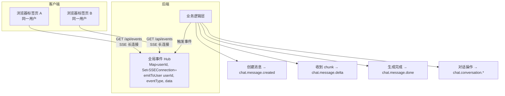

# CLAUDE.md

This file provides guidance to Claude Code (claude.ai/code) when working with code in this repository.

## 项目概述

MJ-Studio 是一个多模型 AI 工作台，支持 AI 绘图（Midjourney、DALL-E、Gemini、Flux 等）、AI 视频生成（即梦、Veo、Sora、Grok Video 等）和 AI 对话（GPT、Claude、DeepSeek 等）。基于 Nuxt 4 + Drizzle ORM + SQLite 构建。

## 常用命令

```bash
# 开发
pnpm dev                    # 启动开发服务器
pnpm build                  # 构建生产版本

# 数据库
pnpm db:generate            # 生成数据库迁移
pnpm db:migrate             # 执行数据库迁移

# 测试
pnpm test                   # 运行所有测试
pnpm test:watch             # 监听模式运行测试
vitest run tests/xxx.test.ts  # 运行单个测试文件
```

## 目录结构

```
app/                          # 前端代码
├── pages/                    # 页面（studio.vue、chat.vue、settings/）
├── components/               # UI 组件
│   ├── chat/                 # 对话相关组件
│   ├── studio/               # 创作工作台组件（绘图/视频）
│   └── settings/             # 设置相关组件
├── composables/              # 组合式函数
└── shared/                   # 前后端共享类型和常量
server/                       # 后端代码
├── api/                      # API 路由
├── services/                 # 业务逻辑
└── database/                 # 数据库 schema 和迁移
data/                         # SQLite 数据库、上传的图片/视频
logs/                         # API 请求/响应日志
docs/                         # 详细设计文档
```

## 组件清单

### 全局组件
| 组件 | 用途 |
|-----|-----|
| `AppHeader.vue` | 顶部导航栏（Logo、导航链接、用户菜单、主题切换） |
| `TimeAgo.vue` | 相对时间显示 |
| `ModelSelector.vue` | 通用模型选择器（下拉列表、分类筛选） |

### 对话组件 (`chat/`)
| 组件 | 用途 |
|-----|-----|
| `MessageList.vue` | 消息列表（Markdown 渲染、代码高亮、图片附件） |
| `MessageInput.vue` | 输入框（文件上传、多模态、模型选择、流式控制） |
| `ConversationList.vue` | 对话列表（新建、删除、重命名、AI 生成标题） |
| `AssistantList.vue` | 助手列表（新建、选择、编辑） |
| `AssistantEditor.vue` | 助手编辑弹窗（名称、描述、头像、System Prompt） |
| `AssistantInfo.vue` | 助手信息展示（右侧栏元数据） |
| `MarkdownContent.vue` | Markdown 渲染（处理 mj-drawing 代码块） |
| `MjDrawingBlock.vue` | 嵌入式绘图组件（对话中渲染绘图参数） |

### 创作工作台组件 (`studio/`)
| 组件 | 用途 |
|-----|-----|
| `Workbench.vue` | 创作工作台容器（切换绘图/视频标签页） |
| `ImageForm.vue` | 绘图表单（提示词、负面提示词、参考图、模型专属参数） |
| `VideoForm.vue` | 视频表单（提示词、参考图、模型专属参数） |
| `List.vue` | 任务列表（分页、筛选、搜索、批量操作） |
| `Card.vue` | 图片任务卡片（结果展示、操作按钮、进度条） |
| `VideoCard.vue` | 视频任务卡片（视频播放、操作按钮、进度条） |
| `TaskDetailModal.vue` | 任务详情弹窗（统一的任务信息展示） |
| `ErrorLogsModal.vue` | 错误详情弹窗（请求/响应日志） |
| `RefImagesModal.vue` | 参考图预览弹窗 |
| `Loader.vue` | 加载动画 |
| `Trash.vue` | 回收站（恢复/永久删除） |

### 设置组件 (`settings/`)
| 组件 | 用途 |
|-----|-----|
| `Layout.vue` | 设置页面布局（侧边栏 + 内容区，移动端适配） |
| `Sidebar.vue` | 设置侧边栏导航 |

## Composables 清单

| Composable | 用途 |
|-----------|-----|
| `useAuth` | JWT 认证（login/logout/token/getAuthHeader） |
| `useUserSettings` | 用户设置持久化 |
| `useTasks` | 绘图任务管理（轮询、状态更新、按钮动作） |
| `useTrash` | 回收站管理 |
| `useConversations` | 对话流式输出（SSE 订阅、打字机效果、消息状态机） |
| `useAssistants` | 助手 CRUD |
| `useUpstreams` | 上游配置管理（包含 aimodels 子表） |
| `useChatModels` | 对话模型筛选（从 useUpstreams 获取数据） |
| `useMarkdown` | Markdown 渲染 + Shiki 代码高亮 |
| `useConversationSuggestions` | 对话开场白建议 |
| `useTimeFormat` | 时间格式化（formatTimeAgo/formatDate/formatDateTime） |
| `useMediaQuery` | 响应式媒体查询（useIsMobile/useIsTablet/useIsDesktop） |

## 架构概览

### 前后端共享类型系统

类型和常量定义在 `app/shared/` 目录，前后端共用：
- `types.ts`: 核心类型定义（ModelCategory、ModelType、ApiFormat、TaskType、TaskStatus、ImageModelParams、VideoModelParams 等）
- `constants.ts`: 常量和映射表（MODEL_TYPE_LABELS、API_FORMAT_LABELS、MODELS_WITH_* 等）

**模型分类**：
- `image`: 绘图模型（Midjourney、DALL-E、Gemini、Flux 等）
- `video`: 视频模型（即梦、Veo 等）
- `chat`: 对话模型（GPT、Claude、DeepSeek 等）

**任务类型**：
- `image`: 图片生成任务
- `video`: 视频生成任务

数据库 schema (`server/database/schema.ts`) 从 shared 导入类型，确保类型一致性。

### 服务层架构

`server/services/` 包含核心业务逻辑：
- `task.ts`: 绘图任务管理，根据 apiFormat 路由到不同服务
- `chat.ts`: 对话服务，支持流式响应和多模态（图片附件）
- `conversation.ts`: 对话会话管理
- `mj.ts`, `gemini.ts`, `dalle.ts`, `openaiChat.ts`, `koukoutu.ts`: 各上游 API 的封装

### API 格式路由

任务根据 `apiFormat` 字段选择处理方式：
- `mj-proxy`: 异步轮询模式（Midjourney）
- `gemini`, `dalle`, `openai-chat`: 同步请求模式
- `koukoutu`: 异步轮询模式（抠抠图）
- `video-unified`: 视频统一格式（即梦、Veo、Sora、Grok Video）

## API 格式详解

| 请求格式 | 文生图接口 | 垫图接口 | 参考图格式 | 返回图片 |
|---------|-----------|---------|-----------|---------|
| MJ-Proxy | `POST /mj/submit/imagine` | 同左 | Base64 数组 | URL |
| Gemini | `POST /v1beta/models/{model}:generateContent` | 同左 | Base64 (inlineData) | Base64 |
| DALL-E | `POST /v1/images/generations` | 同左 | 纯 Base64 | URL / Base64 |
| DALL-E (豆包) | `POST /v1/images/generations` | 同左 | Data URL (`data:image/...;base64,...`) | URL |
| DALL-E (Flux) | `POST /v1/images/edits` | 同左 | multipart/form-data 文件上传 | Base64 |
| OpenAI Chat | `POST /v1/chat/completions` | 同左 | Base64 Data URL | URL (从 Markdown 解析) |
| 抠抠图 | - | `POST /v1/create` | multipart/form-data 文件上传 | URL（异步轮询） |
| Video Unified | `POST /v1/video/create` | 同左 | Base64 / URL | URL（异步轮询） |

### MJ-Proxy 格式

兼容 [midjourney-proxy](https://github.com/novicezk/midjourney-proxy) API：
- `POST /mj/submit/imagine` - 文生图/垫图，参考图通过 `base64Array` 字段上传
- `POST /mj/submit/blend` - 图片混合
- `POST /mj/submit/action` - 按钮操作 (U/V/🔄)
- `GET /mj/task/{id}/fetch` - 轮询任务状态，返回 `imageUrl`

### Gemini 格式

使用 Google Generative Language API：
- `POST /v1beta/models/{model}:generateContent` - 文生图/垫图
- 参考图通过 `inlineData` 字段上传 (Base64)
- 返回图片为 Base64 (`candidates[].content.parts[].inlineData.data`)

### DALL-E 格式

兼容 OpenAI Images API，但不同模型有特殊处理：

**标准 DALL-E**：
- `POST /v1/images/generations` - 文生图/垫图
- 垫图时参考图通过 `image` 字段传递（纯 Base64）
- 返回 `data[].url` 或 `data[].b64_json`

**豆包模型**（模型名含 `doubao`）：
- 同上端点，但 `image` 字段需要完整 Data URL 格式：`data:image/png;base64,...`
- 不发送 `size` 参数（部分上游不支持 `adaptive`）

**Flux 模型**（模型名含 `flux`）：
- `POST /v1/images/edits` - 使用编辑端点
- `multipart/form-data` 格式，图片作为文件上传
- 返回 `data[].b64_json`

### OpenAI Chat 格式

兼容 OpenAI Chat Completions API（支持图像生成的模型）：
- `POST /v1/chat/completions` - 文生图/垫图
- 垫图时参考图通过 `content[].image_url.url` 字段上传 (支持 Base64 Data URL)
- 返回图片 URL 从 `choices[].message.content` 中解析 (Markdown格式)

### 抠抠图格式

智能抠图服务，异步轮询模式（类似 MJ-Proxy）：
- `POST /v1/create` - 创建抠图任务，必须上传图片
- `POST /v1/query` - 轮询任务状态
- 参数：`model_key`（默认 `background-removal`）、`output_format`（webp/png）
- 返回：`state` 0=处理中、1=成功、-1=失败，成功时 `result_file` 为图片 URL

### 视频统一格式

统一的视频生成 API 格式（即梦、Veo、Sora、Grok Video）：
- `POST /v1/video/create` - 创建视频任务
- `POST /v1/video/query` - 轮询任务状态
- 参数：`model`、`prompt`、`aspect_ratio`、`image`（可选参考图）
- 返回：`status`、`video_url`（成功时）、`error`（失败时）

> **开发指南**：添加新视频模型请参考 [docs/视频模型开发指南.md](docs/视频模型开发指南.md)，API 文档见 [docs/api/yunwu-video/](docs/api/yunwu-video/)

## 模型专属参数

各模型支持不同的生成参数，前端根据模型类型动态显示对应的参数控件。

### 图片模型参数 (`ImageModelParams`)

| 模型类型 | 支持的参数 |
|---------|-----------|
| `dalle` | `size`（尺寸）、`quality`（标准/高清）、`style`（生动/自然） |
| `doubao` | `size`（尺寸）、`seed`（随机种子）、`guidanceScale`（提示词相关度）、`watermark`（水印） |
| `flux` | `aspectRatio`（宽高比）、`negativePrompt`（负面提示词） |
| `gpt4o-image` | `size`（尺寸）、`quality`（高/中/低）、`background`（透明/不透明） |
| `midjourney` | `negativePrompt`（负面提示词）、`botType`（MJ/NIJI） |

参数支持由 `constants.ts` 中的 `MODELS_WITH_*` 常量控制：
- `MODELS_WITH_SIZE`: 支持尺寸选择
- `MODELS_WITH_QUALITY`: 支持质量选择
- `MODELS_WITH_STYLE`: 支持风格选择
- `MODELS_WITH_ASPECT_RATIO`: 支持宽高比选择
- `MODELS_WITH_NEGATIVE_PROMPT`: 支持负面提示词
- `MODELS_WITH_SEED`: 支持随机种子
- `MODELS_WITH_GUIDANCE`: 支持提示词相关度
- `MODELS_WITH_WATERMARK`: 支持水印开关
- `MODELS_WITH_BACKGROUND`: 支持背景透明度

> **API 文档**：图片模型 API 参数详见 [docs/api/yunwu-image/](docs/api/yunwu-image/)

### 视频模型参数

| 模型类型 | 支持的参数 |
|---------|-----------|
| `jimeng-video` | `aspectRatio`（宽高比）、`size`（分辨率） |
| `veo` | `aspectRatio`（宽高比）、`enhancePrompt`（提示词增强）、`enableUpsample`（超分辨率） |
| `sora` | `orientation`（方向）、`size`（分辨率）、`duration`（时长）、`watermark`、`private` |
| `grok-video` | `aspectRatio`（宽高比） |

## 资源处理规范

### 核心原则

1. **前端提交**：使用本地 URL（`/api/images/xxx`），不直接提交 Base64
2. **数据库存储**：`resourceUrl` 字段存储本地 URL，不存储 Base64
3. **上游请求**：后端按需将本地 URL 转换为 Base64 发送给上游 API
4. **结果本地化**：上游返回的资源（图片/视频 URL 或 Base64）必须下载/保存到本地，返回本地 URL

### 字段说明

- `tasks.resourceUrl`: 任务产物的本地 URL（图片或视频），替代原来的 `imageUrl`
- `tasks.taskType`: 任务类型（`image` 或 `video`）
- `tasks.modelParams`: 模型专用参数（JSON），存储各模型的特有参数（如 negativePrompt、aspectRatio 等）

### 资源上传流程

```
前端选择图片/视频
    ↓
POST /api/images/upload (multipart/form-data)
    ↓
后端保存到 data/images/，返回本地 URL
    ↓
前端使用本地 URL 提交任务
    ↓
后端读取本地文件，按需转换为 Base64 调用上游
    ↓
上游返回结果（图片/视频）
    ↓
后端本地化（下载/保存），更新 resourceUrl
```

### 各上游 API 的图片格式要求

| 上游服务 | 参考图格式 | 返回图片格式 |
|---------|-----------|-------------|
| MJ-Proxy | 纯 Base64 数组 | HTTP URL |
| Gemini | Data URL (`data:image/...;base64,...`) | Base64 |
| DALL-E | 纯 Base64 / Data URL / FormData（按模型） | URL 或 Base64 |
| OpenAI Chat | Data URL | URL（从 Markdown 解析） |
| 抠抠图 | FormData 文件上传 | HTTP URL |

### 关键函数

- `server/services/file.ts`:
  - `saveUploadedFile()` - 保存上传的文件
  - `downloadFile()` - 下载远程图片到本地
  - `saveBase64Image()` - 保存 Base64 图片到本地
  - `readFileAsBase64()` - 读取本地文件为 Base64
  - `getFileUrl()` - 生成本地访问 URL

## 任务生命周期

```
pending → submitting → processing → success
                   ↘           ↘
                    failed ←────┘
                       ↓
                   (软删除)
                       ↓
                    回收站 → 恢复 / 永久删除
```

## 流式输出系统

对话模块采用**全局事件订阅**模式实现流式输出和多端同步。

### 事件驱动渲染

对话模块的 UI 状态更新采用**事件驱动**模式，而非传统的请求-响应模式：

- **请求仅触发操作**：前端发起 API 请求（如发送消息、删除对话），请求成功只意味着操作已被接受
- **事件驱动渲染**：UI 状态变化由后端通过 SSE 推送的事件驱动，前端监听事件并更新本地状态
- **多端同步**：同一用户的所有浏览器标签页/设备共享同一事件流，一端操作，多端同步

### 架构概览



### 事件类型

**对话模块事件**

| 事件类型 | 触发时机 |
|---------|---------|
| `chat.message.created` | 消息写入数据库成功后 |
| `chat.message.delta` | AI 流式生成过程中收到 chunk |
| `chat.message.done` | AI 流式生成结束 |
| `chat.message.deleted` | 消息删除成功后 |
| `chat.message.updated` | 消息内容编辑成功后 |
| `chat.messages.deleted` | 批量删除消息成功后 |
| `chat.conversation.created` | 对话创建成功后 |
| `chat.conversation.deleted` | 对话删除成功后 |
| `chat.conversation.updated` | 对话标题更新成功后 |

**绘图/视频任务事件**

| 事件类型 | 触发时机 |
|---------|---------|
| `task.created` | 任务创建成功后 |
| `task.status.updated` | 任务状态变化后（提交、处理中、成功、失败） |
| `task.deleted` | 任务删除成功后（软删除） |
| `task.restored` | 任务从回收站恢复后 |
| `task.blur.updated` | 单个任务模糊状态变化后 |
| `tasks.blur.updated` | 批量模糊状态变化后 |

### 消息状态流转

```
created → pending → streaming → completed
                            ↘ stopped
                            ↘ failed
```

### 关键文件

| 文件 | 用途 |
|-----|-----|
| `server/services/globalEvents.ts` | 全局事件 Hub，维护连接映射，提供 `emitToUser` |
| `server/api/events.get.ts` | 全局 SSE 端点 |
| `server/services/streamingTask.ts` | 流式任务管理，发送 delta/done 事件 |
| `server/services/task.ts` | 绘图任务服务，状态更新时发送事件 |
| `app/composables/useGlobalEvents.ts` | 前端事件订阅 composable |
| `app/composables/useConversations.ts` | 对话状态管理，注册事件处理器 |
| `app/composables/useTasks.ts` | 任务状态管理，注册事件处理器 |
| `app/plugins/global-events.client.ts` | 登录后自动建立连接的插件 |

> **详细设计**：[docs/architecture/全局事件订阅系统设计.md](docs/architecture/全局事件订阅系统设计.md)

## API 接口清单

### 认证
| 方法 | 端点 | 功能 |
|-----|------|-----|
| POST | `/api/auth/login` | 用户登录 |
| POST | `/api/auth/register` | 用户注册 |

### 用户
| 方法 | 端点 | 功能 |
|-----|------|-----|
| GET | `/api/user` | 获取当前用户信息 |
| PUT | `/api/user` | 更新用户信息 |

### 助手
| 方法 | 端点 | 功能 |
|-----|------|-----|
| GET | `/api/assistants` | 获取助手列表 |
| POST | `/api/assistants` | 创建助手 |
| GET | `/api/assistants/[id]` | 获取助手详情 |
| PUT | `/api/assistants/[id]` | 更新助手 |
| DELETE | `/api/assistants/[id]` | 删除助手 |
| POST | `/api/assistants/[id]/suggestions` | 获取开场白建议 |

### 上游配置
| 方法 | 端点 | 功能 |
|-----|------|-----|
| GET | `/api/upstreams` | 获取上游配置列表（包含 aimodels） |
| POST | `/api/upstreams` | 创建上游配置 |
| PUT | `/api/upstreams/[id]` | 更新上游配置 |
| DELETE | `/api/upstreams/[id]` | 删除上游配置 |
| GET | `/api/upstreams/[id]/balance` | 查询上游配置的余额 |

### 对话
| 方法 | 端点 | 功能 |
|-----|------|-----|
| GET | `/api/conversations` | 获取对话列表（按 assistantId 筛选） |
| POST | `/api/conversations` | 创建新对话 |
| GET | `/api/conversations/[id]` | 获取对话详情及消息 |
| PUT | `/api/conversations/[id]` | 更新对话标题 |
| DELETE | `/api/conversations/[id]` | 删除对话 |
| POST | `/api/conversations/[id]/messages` | 发送消息（触发 AI 回复） |
| POST | `/api/conversations/[id]/messages-manual` | 手动添加消息 |
| POST | `/api/conversations/[id]/generate-title` | AI 生成对话标题 |
| POST | `/api/conversations/[id]/compress` | 压缩对话历史 |

### 消息
| 方法 | 端点 | 功能 |
|-----|------|-----|
| POST | `/api/messages/[id]/stop` | 停止消息生成 |
| PATCH | `/api/messages/[id]` | 编辑消息内容 |
| DELETE | `/api/messages/[id]` | 删除消息 |
| POST | `/api/messages/[id]/replay` | 重放消息 |
| POST | `/api/messages/[id]/fork` | 分叉对话 |
| POST | `/api/messages/[id]/delete-until` | 删除指定消息及之前的消息 |

### 全局事件
| 方法 | 端点 | 功能 |
|-----|------|-----|
| GET | `/api/events` | 全局 SSE 订阅（用户级，支持多端同步） |

### 绘图任务
| 方法 | 端点 | 功能 |
|-----|------|-----|
| GET | `/api/tasks` | 获取任务列表（分页、筛选） |
| POST | `/api/tasks` | 创建任务 |
| GET | `/api/tasks/[id]` | 获取任务详情 |
| GET | `/api/tasks/[id]/logs` | 获取任务日志 |
| DELETE | `/api/tasks/[id]` | 删除任务（软删除） |
| POST | `/api/tasks/[id]/retry` | 重试失败任务 |
| POST | `/api/tasks/[id]/cancel` | 取消进行中任务 |
| PATCH | `/api/tasks/[id]/blur` | 切换图片模糊状态 |
| PATCH | `/api/tasks/blur-batch` | 批量切换模糊状态 |
| POST | `/api/tasks/action` | 执行按钮动作（U/V/🔄） |
| GET | `/api/tasks/trash` | 获取回收站列表 |
| POST | `/api/tasks/[id]/restore` | 恢复任务 |
| DELETE | `/api/tasks/trash/empty` | 清空回收站 |

### 文件
| 方法 | 端点 | 功能 |
|-----|------|-----|
| POST | `/api/files/upload` | 上传文件（对话附件） |
| GET | `/api/files/[name]` | 下载文件 |
| POST | `/api/images/upload` | 上传图片（绘图参考图） |
| GET | `/api/images/[name]` | 获取图片 |

### 设置
| 方法 | 端点 | 功能 |
|-----|------|-----|
| GET | `/api/settings` | 获取用户设置 |
| PUT | `/api/settings` | 更新用户设置 |

## 日志系统

所有 API 请求和响应会记录到 `logs/` 目录，便于排查问题：

```
logs/
└── 2025-12-16/           # 按日期分组
    └── 57/               # 按任务ID分组
        ├── request.json  # 请求数据（URL、headers、body）
        └── response.json # 响应数据（状态码、响应体、错误）
```

日志中敏感信息会自动处理：
- `Authorization` header 显示为 `[REDACTED]`
- Base64 图片数据显示为 `[base64 N chars]` 或 `[dataUrl N chars]`

## 数据库迁移

```bash
# 生成迁移文件（根据 schema.ts 变更）
pnpm db:generate

# 执行迁移
pnpm db:migrate
```

迁移文件位于 `server/database/migrations/`，数据库文件位于 `data/mj-studio.db`。

### 添加新迁移

1. 修改 `server/database/schema.ts` 中的表结构
2. 运行 `pnpm db:generate` 生成迁移文件
3. 检查生成的 SQL 文件是否正确
4. 运行 `pnpm db:migrate` 执行迁移
5. 提交 schema.ts 和迁移文件

### 迁移规范

- **禁止手动修改 meta 文件夹**：`_journal.json` 和 `*_snapshot.json` 由工具自动维护
- **snapshot 文件的作用**：记录每次迁移后的完整 schema 状态，用于生成增量迁移
- **自动迁移**：应用启动时通过 Nitro plugin (`server/plugins/migrate.ts`) 自动执行迁移
- **SQLite 版本**：项目使用的 SQLite 支持 `ALTER TABLE ... DROP COLUMN`（3.35.0+），可直接删除列

### 处理需要交互的迁移（重命名/删除列）

`drizzle-kit generate` 在检测到列重命名时会提示用户选择，这在 CI/CD 或非交互环境下无法工作。

**解决方案**：使用 `--custom` 生成空迁移后手动编写 SQL

```bash
# 1. 生成空迁移文件（会同时生成 snapshot）
pnpm drizzle-kit generate --custom --name=my-migration

# 2. 手动编辑生成的 SQL 文件
# 3. 确保 SQL 与 schema.ts 的变更一致
```

**注意**：
- 手动编写 SQL 时必须确保与 schema.ts 的变更完全匹配
- 如果需要数据迁移（如列值转换），在 SQL 中添加 UPDATE 语句
- 复杂的数据迁移可在 `server/plugins/migrate.ts` 中处理（在 SQL 迁移之后执行）

## UI 组件规范

本项目使用 **Nuxt UI 4**，设计风格基于 Fluent 2。详细规范见 [docs/设计系统规范.md](docs/设计系统规范.md)。

### 核心原则

1. **优先使用组件 props**：如 `color`、`variant`、`size`，而非自定义 class
2. **使用 CSS 变量**：如 `text-(--ui-text-muted)`、`bg-(--ui-bg-elevated)`
3. **避免硬编码颜色**：使用主题变量确保深色模式兼容
4. **移动端优先**：默认样式针对移动端，通过断点扩展桌面端

### 表单组件

**必须使用 `UForm` + `UFormField` 组合**，而非手动写 `<label>` 标签。

### 模态框

使用 `UModal` 组件，通过 `:ui` 属性调整宽度。


## 注意事项

- 添加新模型类型时，需同步更新 `app/shared/types.ts` 和 `app/shared/constants.ts` 中的相关定义
- 测试超时设置为 120 秒（MJ 生图需要较长时间）

## 参考链接

- [Nuxt 4 文档](https://nuxt.com/docs)
- [Nuxt UI 3 文档](https://ui.nuxt.com/)
- [Drizzle ORM 文档](https://orm.drizzle.team/)
- [midjourney-proxy API](https://github.com/novicezk/midjourney-proxy)
