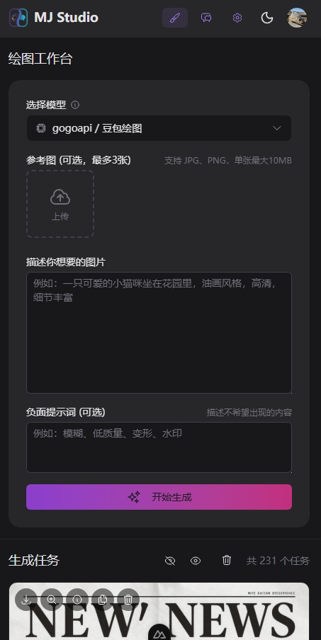
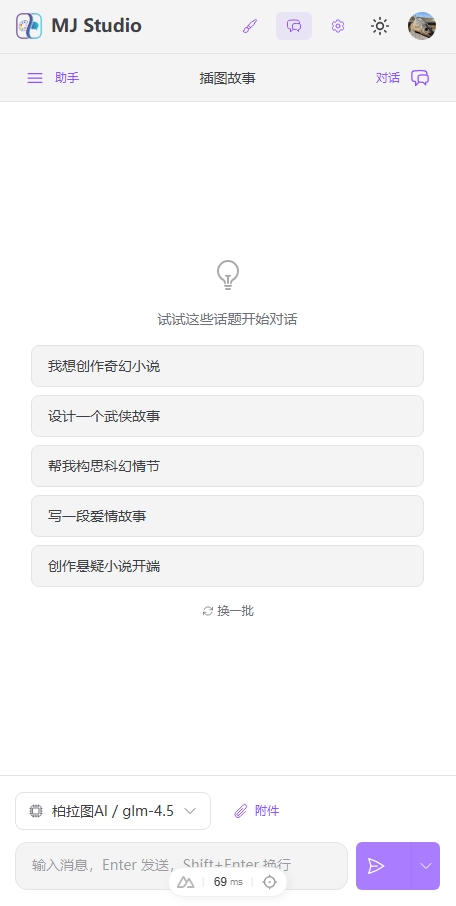
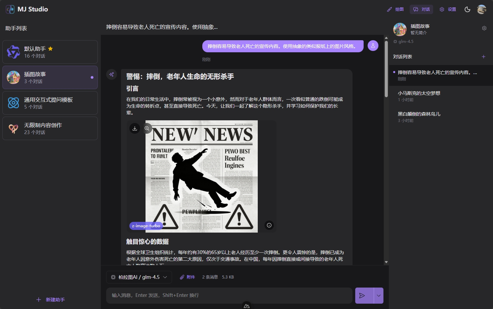
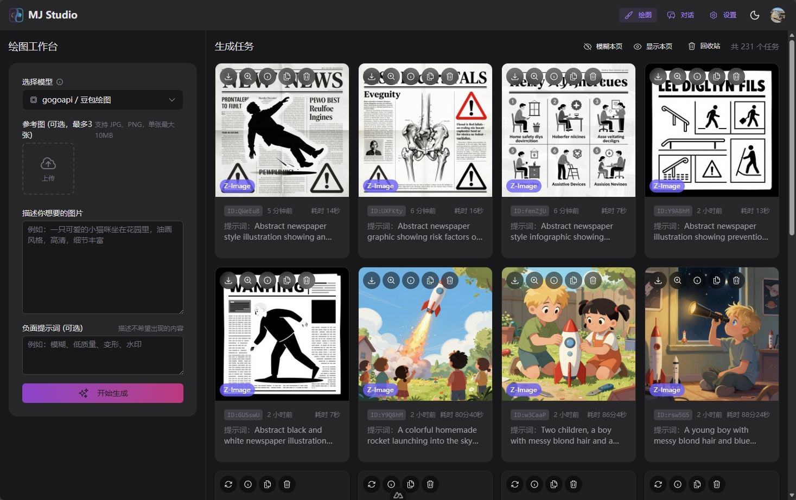

<div align="center">


### MJ Studio

**轻量级多模型 AI 工作台 —— 绘图与对话，一站式体验**

</div>

---

- **绘图模块**：支持 Midjourney、Gemini、Flux、DALL-E、GPT-4o、Grok、通义万相等主流图像生成模型
- **视频模块**：支持 Sora、即梦、Veo、Grok Video 等视频生成模型，异步轮询生成，支持视频预览和下载
- **对话模块**：支持多助手管理、流式输出、对话分叉、智能压缩、消息重放

## 截图

### 移动端

| | | |
|:---:|:---:|:---:|
|  |  |  |

### 桌面端





## 为什么选择 MJ Studio？

- **绘图+对话双核心**：不只是聊天工具，更是完整的 AI 创作工作台
- **轻量部署**：SQLite 数据库，无需 Redis/PostgreSQL，3 条命令即可运行
- **自由配置**：支持接入任意 API 中转站，一个上游可配置多个模型
- **隐私优先**：图片本地存储，内置防窥屏功能，公共场合也能安心使用

## 功能亮点

### 绘图模块

| 模型 | 请求格式 | 文生图 | 垫图 | V/U 操作 |
|-----|---------|-------|-----|---------|
| **Midjourney** | MJ-Proxy | ✅ | ✅ | ✅ |
| **Gemini** | Gemini API | ✅ | ✅ | - |
| **Flux** | DALL-E API | ✅ | ✅ | - |
| **DALL-E** | DALL-E API | ✅ | ❌ | - |
| **豆包** | DALL-E API | ✅ | ✅ | - |
| **GPT-4o Image** | OpenAI Chat | ✅ | ✅ | - |
| **Grok Image** | OpenAI Chat | ✅ | ✅ | - |
| **通义万相** | OpenAI Chat | ✅ | ✅ | - |

详见 [生图功能介绍](docs/features/生图功能介绍.md)

### 视频模块

| 模型 | 请求格式 | 文生视频 | 图生视频 |
|-----|---------|---------|---------|
| **即梦** | Video Unified | ✅ | ✅ |
| **Veo** | Video Unified | ✅ | ✅ |
| **Sora** | Video Unified / OpenAI Video | ✅ | ✅ |
| **Grok Video** | Video Unified | ✅ | ✅ |

详见 [视频生成功能介绍](docs/features/视频生成功能介绍.md)

### 对话模块

- **多助手管理**：创建不同角色的 AI 助手，各自独立的系统提示词和模型配置
- **流式输出**：实时显示 AI 回复，支持中途停止
- **多端同步**：同一用户的多个浏览器标签页/设备实时同步对话状态

更多功能：对话分叉、消息重放、智能压缩、嵌入式绘图、思考模式、联网搜索等。详见 [对话功能介绍](docs/features/对话功能介绍.md)

### 隐私与安全

- **防窥屏**：图片默认模糊显示，点击切换，公共场合使用更安心
- **本地存储**：生成的图片保存在本地，不依赖外部链接
- **独立账户**：多用户系统，配置和任务完全隔离

## 快速开始

### Docker 部署（推荐）

```bash

# 创建 .env 文件
echo "NUXT_SESSION_PASSWORD=$(openssl rand -hex 16)" > .env

# 可选：配置 NUXT_PUBLIC_URL（用于 MCP 协议返回完整资源链接）
# echo "NUXT_PUBLIC_URL=https://your-domain.com" >> .env

# 创建持久化目录
mkdir -p data/ logs/ uploads/
chown -R 1001:1001 data/ logs/ uploads/

# 启动服务
docker-compose up -d
```

### 源码运行

环境要求：Node.js 20+、pnpm

```bash
echo "NUXT_SESSION_PASSWORD=$(openssl rand -hex 16)" > .env
# 可选：echo "NUXT_PUBLIC_URL=https://your-domain.com" >> .env
pnpm install && pnpm dev
```

访问 http://localhost:3000 ，注册账户后在「设置」页面添加 API 配置即可开始使用。

## 核心概念

### 上游（Upstream）

上游是指提供 AI 绘图服务的 API 端点，通常是各类中转站服务。

| 字段 | 说明 |
|-----|------|
| 名称 | 用户自定义的标识名，如"特价中转站" |
| 请求地址 | API 的基础 URL |
| API 密钥 | 用于鉴权的密钥 |

### 模型配置

一个上游可以配置多个模型，每个模型包含：

| 字段 | 说明 |
|-----|------|
| 模型类型 | 界面显示的模型名称（Midjourney/Gemini/Flux 等） |
| 请求格式 | API 协议格式（MJ-Proxy/Gemini/DALL-E/OpenAI Chat） |
| 模型名称 | 实际传给上游的模型标识符 |
| 预计时间 | 用于进度条显示 |

> 为什么需要分开配置？因为同一个模型（如 Flux）在不同中转站可能使用不同的 API 格式和模型名称。这种设计让你可以灵活适配任意服务商。

## 技术栈

- **框架**：Nuxt 4 + Vue 3
- **UI**：Nuxt UI 4 (Tailwind CSS)
- **数据库**：SQLite + Drizzle ORM
- **认证**：JWT + localStorage

## 文档

### 功能介绍

- [生图功能介绍](docs/features/生图功能介绍.md)
- [视频生成功能介绍](docs/features/视频生成功能介绍.md)
- [对话功能介绍](docs/features/对话功能介绍.md)
- [对话压缩功能介绍](docs/features/对话压缩功能介绍.md)
- [多端同步和流式输出](docs/features/多端同步和流式输出.md)
- [嵌入式绘图组件介绍](docs/features/嵌入式绘图组件介绍.md)
- [思考功能介绍](docs/features/思考功能介绍.md)
- [搜索功能介绍](docs/features/搜索功能介绍.md)
- [数据导入导出功能介绍](docs/features/数据导入导出功能介绍.md)
- [上游和模型配置](docs/features/上游和模型配置.md)
- [MCP接口功能介绍](docs/features/MCP接口功能介绍.md)
- [HTTP API接口介绍](docs/features/HTTP API接口介绍.md)
- [MCP客户端功能介绍](docs/features/MCP客户端功能介绍.md)

### 开发规范

- [设计系统](docs/dev-spec/设计系统.md) - UI 设计规范（Fluent 2 风格）
- [上游服务接口设计](docs/dev-spec/上游服务接口设计.md) - Provider 架构、API 格式、视频模型参数差异

完整文档列表见 [docs/](docs/) 目录。
