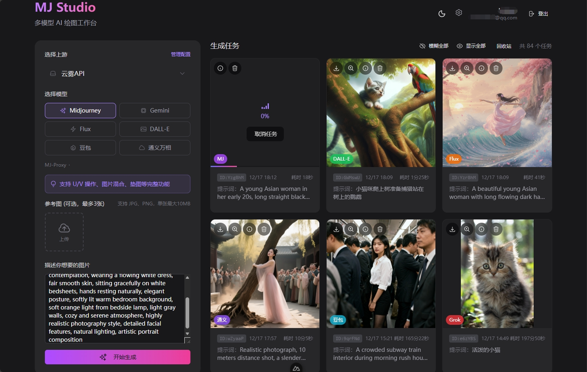

<div align="center">


### MJ Studio

**轻量级多模型 AI 工作台 —— 绘图与对话，一站式体验**

</div>

---

- **绘图模块**：支持 Midjourney、Gemini、Flux、DALL-E、GPT-4o、Grok、通义万相等主流图像生成模型
- **对话模块**：支持多助手管理、流式输出、对话分叉、智能压缩、消息重放



## 为什么选择 MJ Studio？

- **绘图+对话双核心**：不只是聊天工具，更是完整的 AI 创作工作台
- **轻量部署**：SQLite 数据库，无需 Redis/PostgreSQL，3 条命令即可运行
- **自由配置**：支持接入任意 API 中转站，一个上游可配置多个模型
- **隐私优先**：图片本地存储，内置防窥屏功能，公共场合也能安心使用

## 功能亮点

### 绘图模块

| 模型 | 请求格式 | 文生图 | 垫图 | V/U 操作 |
|-----|---------|-------|-----|---------|
| **Midjourney** | MJ-Proxy | ✅ | ✅ | ✅ |
| **Gemini** | Gemini API | ✅ | ✅ | - |
| **Flux** | DALL-E API | ✅ | ✅ | - |
| **DALL-E** | DALL-E API | ✅ | ❌ | - |
| **豆包** | DALL-E API | ✅ | ✅ | - |
| **GPT-4o Image** | OpenAI Chat | ✅ | ✅ | - |
| **Grok Image** | OpenAI Chat | ✅ | ✅ | - |
| **通义万相** | OpenAI Chat | ✅ | ✅ | - |

- **实时进度**：炫彩进度条 + 预计时间，直观掌握生成进度
- **任务取消**：支持中止进行中的任务，节省 API 额度
- **失败重试**：一键重试失败任务，无需重新输入
- **回收站**：误删任务可恢复，重要作品不丢失
- **批量操作**：一键模糊/显示所有图片

### 对话模块

- **多助手管理**：创建不同角色的 AI 助手，各自独立的系统提示词和模型配置
- **流式输出**：打字机效果实时显示 AI 回复，支持中途停止
- **对话分叉**：从任意消息创建分支，探索不同对话方向而不丢失原有内容
- **消息重放**：对任意历史消息重新生成 AI 回复，不满意随时重来
- **智能压缩**：长对话自动压缩为摘要，节省 token 的同时保留完整上下文，压缩后的原始消息仍可查看
- **智能标题**：根据对话内容自动生成标题

### 隐私与安全

- **防窥屏**：图片默认模糊显示，点击切换，公共场合使用更安心
- **本地存储**：生成的图片保存在本地，不依赖外部链接
- **独立账户**：多用户系统，配置和任务完全隔离

## 快速开始

### Docker 部署（推荐）

```bash
# 创建 .env 文件
echo "NUXT_SESSION_PASSWORD=$(openssl rand -hex 16)" > .env

# 启动服务
docker-compose up -d
```

### 源码运行

环境要求：Node.js 20+、pnpm

```bash
echo "NUXT_SESSION_PASSWORD=$(openssl rand -hex 16)" > .env
pnpm install && pnpm dev
```

访问 http://localhost:3000 ，注册账户后在「设置」页面添加 API 配置即可开始使用。

## 核心概念

### 上游（Upstream）

上游是指提供 AI 绘图服务的 API 端点，通常是各类中转站服务。

| 字段 | 说明 |
|-----|------|
| 名称 | 用户自定义的标识名，如"特价中转站" |
| 请求地址 | API 的基础 URL |
| API 密钥 | 用于鉴权的密钥 |

### 模型配置

一个上游可以配置多个模型，每个模型包含：

| 字段 | 说明 |
|-----|------|
| 模型类型 | 界面显示的模型名称（Midjourney/Gemini/Flux 等） |
| 请求格式 | API 协议格式（MJ-Proxy/Gemini/DALL-E/OpenAI Chat） |
| 模型名称 | 实际传给上游的模型标识符 |
| 预计时间 | 用于进度条显示 |

> 为什么需要分开配置？因为同一个模型（如 Flux）在不同中转站可能使用不同的 API 格式和模型名称。这种设计让你可以灵活适配任意服务商。

## 技术栈

- **框架**：Nuxt 4 + Vue 3
- **UI**：Nuxt UI 3 (Tailwind CSS)
- **数据库**：SQLite + Drizzle ORM
- **认证**：JWT + localStorage

## 文档

- [**CLAUDE.md**](CLAUDE.md) - 开发指南：目录结构、API 格式、日志系统
- [**docs/对话功能需求文档.md**](docs/对话功能需求文档.md) - 对话模块完整需求
- [**docs/流式输出系统设计和实现规范.md**](docs/流式输出系统设计和实现规范.md) - SSE 流式输出架构
- [**docs/对话压缩逻辑.md**](docs/对话压缩逻辑.md) - 长对话压缩机制
- [**docs/绘图任务错误规范.md**](docs/绘图任务错误规范.md) - 错误分类与识别规则
- [**docs/日志规范需求.md**](docs/日志规范需求.md) - API 请求日志系统
