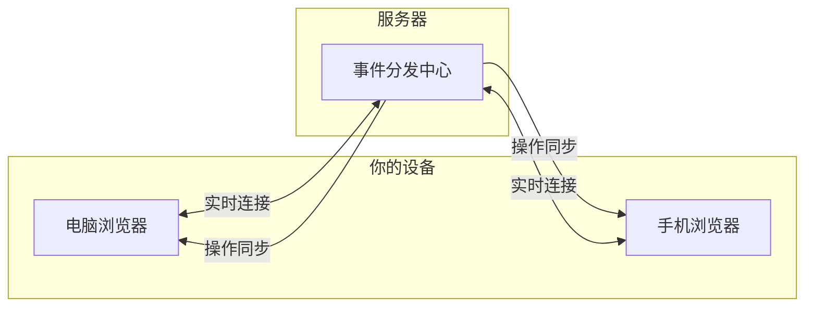

# 实时同步与流式输出

本文档介绍 MJ Studio 的实时同步功能，覆盖对话模块和绘图/视频任务模块。

## 功能介绍

### AI 回复实时显示

当你发送消息后，AI 的回复会以打字机效果逐字显示，让你实时看到生成过程，无需等待全部生成完成。

### 任务状态实时更新

创建绘图或视频任务后，状态变化（提交中、处理中、成功、失败）会实时推送到前端，无需手动刷新。

### 多端实时同步

在多个浏览器标签页或设备上登录同一账号时，所有操作会实时同步：

- 在 A 标签页发送消息，B 标签页会立即看到新消息和 AI 回复
- 在手机上删除对话，电脑上的对话列表会同步更新
- 在一处编辑消息内容，其他终端会即时显示修改
- 在 A 标签页创建绘图任务，B 标签页会看到任务出现并实时更新状态

### 同步的操作

**对话模块**

| 操作 | 同步效果 |
|-----|---------|
| 发送消息 | 所有终端显示新消息 |
| AI 生成回复 | 所有终端同步显示打字机效果 |
| 创建对话 | 所有终端的对话列表添加新对话 |
| 删除对话 | 所有终端的对话列表移除该对话 |
| 重命名对话 | 所有终端显示新标题 |
| 编辑消息 | 所有终端显示修改后的内容 |
| 删除消息 | 所有终端移除该消息 |

**绘图/视频任务模块**

| 操作 | 同步效果 |
|-----|---------|
| 创建任务 | 所有终端的任务列表添加新任务 |
| 任务状态变化 | 所有终端实时显示最新状态和进度 |
| 删除任务 | 所有终端的任务列表移除该任务 |
| 恢复任务 | 所有终端的任务列表重新显示该任务 |
| 切换模糊状态 | 所有终端同步显示模糊/清晰状态 |

## 工作原理



系统采用 Server-Sent Events (SSE) 技术建立长连接。当你登录后，浏览器会自动与服务器建立连接，服务器在任何操作发生时推送更新到你的所有终端。

## 部署注意事项

如果使用 Nginx 反向代理，需要为 SSE 端点禁用缓冲：

```nginx
location = /api/events {
    proxy_pass http://localhost:3000;
    proxy_http_version 1.1;
    proxy_set_header Host $host;
    proxy_set_header Connection '';
    proxy_buffering off;
    proxy_cache off;
    proxy_read_timeout 86400s;
}
```

## 当前限制

- **单实例部署**：目前仅支持单进程部署，多实例需要额外配置
- **断线不重放**：断线重连后不会补发错过的事件，页面刷新即可获取最新状态
