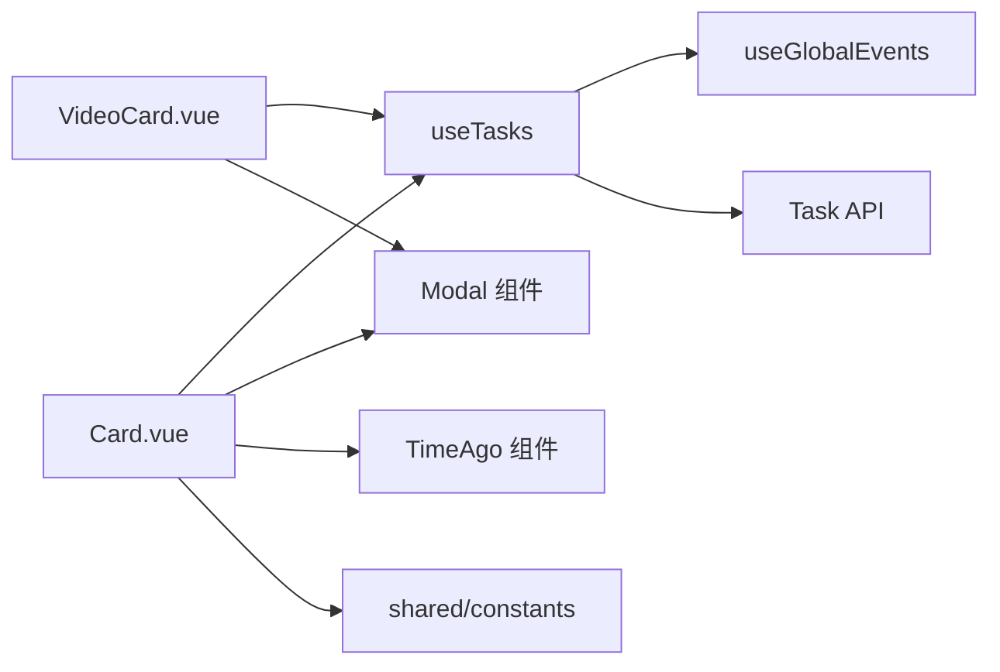
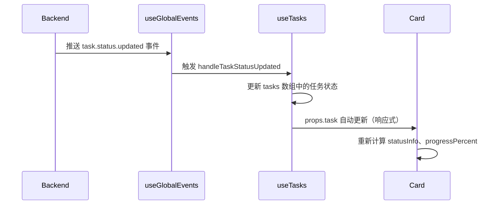

# 任务卡片组件设计文档

## 概述

任务卡片组件负责在创作工作台（Studio）中展示图片/视频生成任务的状态、预览、操作按钮等信息。包含两个独立组件：

- `app/components/studio/Card.vue` - 图片任务卡片
- `app/components/studio/VideoCard.vue` - 视频任务卡片

两个组件共享相同的架构设计和交互逻辑，但在媒体展示和特定操作上有所差异。

## 组件职责

### 核心职责

1. **任务状态可视化**
   - 显示任务状态（等待中、提交中、生成中、已完成、失败、已取消）
   - 实时更新进度（通过进度条和倒计时）
   - 区分不同状态下的图标和颜色

2. **媒体预览**
   - 图片卡片：图片预览 + 棋盘格背景（支持透明图层）
   - 视频卡片：内嵌视频播放器（带原生控制条）
   - 支持模糊遮罩（防窥屏）

3. **操作集成**
   - 通用操作：删除、重试、取消、复制到工作台、查看详情
   - 图片特有：Midjourney 按钮操作（U/V/🔄）、下载图片、放大查看
   - 视频特有：下载视频、全屏播放

4. **元数据展示**
   - 任务 ID（可复制）、创建时间（相对时间）、耗时统计
   - 提示词（支持多行截断）
   - 模型类型标签（带颜色标识）
   - 参考图数量角标

5. **弹窗管理**
   - 任务详情弹窗（完整元数据）
   - 参考图预览弹窗
   - 错误日志弹窗（请求/响应日志）
   - 媒体预览弹窗（大图/全屏视频）

### 非职责边界

- **不负责**任务列表的分页、筛选、排序（由父组件 `List.vue` 处理）
- **不负责**任务创建和状态轮询（由 `useTasks` composable 处理）
- **不负责**文件上传（由 `ImageForm.vue` / `VideoForm.vue` 处理）

## 架构设计

### 组件层次结构

```
┌─────────────────────────────────────┐
│  Card.vue / VideoCard.vue            │
│  ┌───────────────────────────────┐  │
│  │  媒体预览区（aspect-square）   │  │
│  │  ┌─────────────────────────┐  │  │
│  │  │ 图片/视频 + 状态图标      │  │  │
│  │  │ 模糊遮罩（可选）          │  │  │
│  │  └─────────────────────────┘  │  │
│  │  ┌─────────────────────────┐  │  │
│  │  │ 左上角操作按钮组          │  │  │
│  │  │ 右上角状态角标            │  │  │
│  │  │ 左下角模型标签            │  │  │
│  │  │ 右下角参考图角标          │  │  │
│  │  │ 底部进度条（可选）        │  │  │
│  │  └─────────────────────────┘  │  │
│  └───────────────────────────────┘  │
│  ┌───────────────────────────────┐  │
│  │  信息区（p-4）                 │  │
│  │  - 任务 ID + 时间              │  │
│  │  - 提示词                      │  │
│  └───────────────────────────────┘  │
└─────────────────────────────────────┘

引用组件：
├── StudioLoader (加载动画)
├── StudioTaskDetailModal (任务详情)
├── StudioRefImagesModal (参考图预览)
└── StudioErrorLogsModal (错误日志)
```

### 依赖关系



**关键依赖说明**：

1. **`useTasks` Composable**：提供任务 CRUD 操作和全局 SSE 事件订阅
2. **`shared/constants`**：模型显示配置（`TASK_CARD_MODEL_DISPLAY`）、默认估算时间常量
3. **`shared/types`**：类型定义（`Task`、`ModelType`、`ModelParams`）
4. **全局 SSE 事件系统**：任务状态变更通过事件驱动更新，而非轮询

## Props 定义

### Card.vue / VideoCard.vue

```typescript
interface Props {
  task: Task  // 任务对象（完整类型见下文）
}
```

**Task 类型定义**（简化）：

```typescript
interface Task {
  id: number
  taskType: 'image' | 'video'
  modelType: ModelType  // 'midjourney' | 'dalle' | 'flux' | 'gemini' | ...
  modelName: string
  status: 'pending' | 'submitting' | 'processing' | 'success' | 'failed' | 'cancelled'
  prompt: string | null
  modelParams: ModelParams | null  // 模型专属参数（如 negativePrompt, aspectRatio）
  images: string[]  // 参考图 URL 数组
  resourceUrl: string | null  // 生成的图片/视频 URL
  error: string | null
  isBlurred: boolean  // 模糊状态
  progress: string | null  // 进度文本（如 "80%"）
  buttons: Array<{  // Midjourney 专属按钮（仅图片任务）
    customId: string
    emoji: string
    label: string
    style: number
    type: number
  }> | null
  upstream?: {  // 上游配置摘要
    name: string
    estimatedTime: number | null  // 预计生成时间（秒）
  }
  createdAt: string
  updatedAt: string
}
```

## 事件接口

### Card.vue

```typescript
interface Emits {
  action: [customId: string]  // 执行 MJ 按钮操作
  remove: []  // 删除任务
  retry: []  // 重试失败任务
  cancel: []  // 取消进行中任务
  blur: [isBlurred: boolean]  // 切换模糊状态
  copyToPanel: [  // 复制到工作台
    prompt: string | null,
    modelParams: ImageModelParams | null,
    images: string[]
  ]
}
```

### VideoCard.vue

```typescript
interface Emits {
  remove: []
  retry: []
  cancel: []
  blur: [isBlurred: boolean]
  copyToPanel: [  // 视频卡片不传 modelParams
    prompt: string | null,
    images: string[]
  ]
}
```

## 状态管理

### 本地状态（Reactive State）

| 状态 | 类型 | 说明 |
|-----|------|-----|
| `isBlurred` | `Ref<boolean>` | 模糊状态（从 `task.isBlurred` 初始化，支持外部更新） |
| `now` | `Ref<number>` | 当前时间戳（用于进度条计算，500ms 更新） |
| `progressTimer` | `Ref<ReturnType<typeof setInterval> \| null>` | 进度条定时器 |
| `showDeleteConfirm` | `Ref<boolean>` | 删除确认弹窗 |
| `showImagePreview` / `showVideoPreview` | `Ref<boolean>` | 媒体预览弹窗 |
| `showTaskDetail` | `Ref<boolean>` | 任务详情弹窗 |
| `showErrorLogs` | `Ref<boolean>` | 错误日志弹窗 |
| `showRefImages` | `Ref<boolean>` | 参考图弹窗 |
| `isActioning` | `Ref<boolean>` | MJ 按钮操作中（仅 Card.vue） |

### 计算属性（Computed）

| 计算属性 | 返回类型 | 说明 |
|---------|---------|-----|
| `statusInfo` | `{ text, color, icon, showBars }` | 状态显示信息 |
| `modelInfo` | `{ label, type, color }` | 模型标签信息（来自 `TASK_CARD_MODEL_DISPLAY`） |
| `isLoading` | `boolean` | 是否加载中（`pending/submitting/processing`） |
| `estimatedTime` | `number` | 预计生成时间（秒），优先级：上游配置 > 模型默认 > 60 秒 |
| `progressPercent` | `number` | 进度百分比（0-100） |
| `duration` | `string \| null` | 耗时字符串（如 "1分30秒"） |
| `buttons` | `Array` | MJ 按钮列表（仅 Card.vue） |
| `dropdownItems` | `Array` | MJ 按钮下拉菜单项（分组：放大/变体/重绘） |
| `hasRefImages` | `boolean` | 是否有参考图 |

### 生命周期钩子

```typescript
// 监听加载状态，启动/停止进度条定时器
watch(isLoading, (loading) => {
  if (loading) {
    now.value = Date.now()
    progressTimer = setInterval(() => {
      now.value = Date.now()
    }, 500)  // PROGRESS_UPDATE_INTERVAL_MS
  } else if (progressTimer) {
    clearInterval(progressTimer)
  }
}, { immediate: true })

// 组件卸载时清理定时器
onUnmounted(() => {
  if (progressTimer) clearInterval(progressTimer)
})

// 监听外部模糊状态变化（批量切换时）
watch(() => props.task.isBlurred, (newVal) => {
  if (newVal !== undefined) {
    isBlurred.value = newVal
  }
})
```

## 交互逻辑

### 1. 状态可视化

#### 状态到图标/颜色映射

```typescript
const statusInfo = computed(() => {
  switch (props.task.status) {
    case 'pending':
      return { text: '等待中', color: 'text-(--ui-warning)', icon: 'i-heroicons-clock', showBars: false }
    case 'submitting':
      return { text: '提交中', color: 'text-(--ui-info)', icon: null, showBars: true }
    case 'processing':
      return { text: task.progress || '生成中', color: 'text-(--ui-primary)', icon: null, showBars: true }
    case 'success':
      return { text: '已完成', color: 'text-(--ui-success)', icon: 'i-heroicons-check-circle', showBars: false }
    case 'failed':
      return { text: '失败', color: 'text-(--ui-error)', icon: 'i-heroicons-x-circle', showBars: false }
    case 'cancelled':
      return { text: '已取消', color: 'text-(--ui-text-muted)', icon: 'i-heroicons-no-symbol', showBars: false }
  }
})
```

#### 进度条计算

**公式**（来自 `shared/constants`）：

```typescript
const progressPercent = computed(() => {
  if (!isLoading.value) return 0
  const start = new Date(task.createdAt).getTime()
  const elapsed = (now.value - start) / 1000  // 秒
  const bufferedTime = estimatedTime.value * 1.1  // PROGRESS_TIME_BUFFER_RATIO
  return Math.min((elapsed / bufferedTime) * 100, 100)
})
```

**参数来源**：
- `estimatedTime`: 优先使用 `task.upstream.estimatedTime`，回退到模型默认值（`DEFAULT_VIDEO_ESTIMATED_TIMES[modelType]`）或 60 秒
- `PROGRESS_TIME_BUFFER_RATIO = 1.1`: 缓冲系数，避免进度条过早到达 100%
- `PROGRESS_UPDATE_INTERVAL_MS = 500`: 定时器更新间隔（500ms）

### 2. 模糊遮罩（防窥屏）

#### 交互逻辑

```typescript
// 点击图片/视频区域切换模糊状态
function handleImageClick() {
  toggleBlur(!isBlurred.value)
}

// 切换模糊状态并同步到后端
async function toggleBlur(blur: boolean) {
  isBlurred.value = blur  // 立即更新本地状态（乐观更新）
  emit('blur', blur)  // 通知父组件
  try {
    await $fetch(`/api/tasks/${task.id}/blur`, {
      method: 'PATCH',
      body: { isBlurred: blur }
    })
  } catch (error) {
    console.error('保存模糊状态失败:', error)
    // 失败时不回滚，因为 SSE 事件会同步最终状态
  }
}
```

**视觉效果**：
- 图片：`blur-xl scale-105` + 无棋盘格背景
- 视频：`blur-xl scale-105`

### 3. 操作按钮

#### 左上角按钮组（浮动 + 半透明背景）

**图片卡片**：

| 按钮 | 显示条件 | 操作 |
|-----|---------|-----|
| 下载 | `task.resourceUrl` 存在 | 触发浏览器下载（`<a download>`） |
| 放大查看 | `task.resourceUrl` 存在 | 打开大图预览弹窗 |
| MJ 操作 | `modelType === 'midjourney' && buttons.length > 0` | 下拉菜单（U/V/🔄） |
| 重试 | `status === 'failed' \| 'cancelled'` | `emit('retry')` |
| 详情 | 始终 | 打开任务详情弹窗 |
| 复制到工作台 | 始终 | `emit('copyToPanel', ...)` |
| 删除 | 始终 | 打开删除确认弹窗 |

**视频卡片**：
- 移除 MJ 操作按钮
- 放大查看改为全屏播放
- 其余按钮逻辑相同

#### Midjourney 按钮下拉菜单（仅图片卡片）

```typescript
const dropdownItems = computed(() => {
  const items: any[][] = []

  // 分组 1: 放大 U1-U4
  const upscaleButtons = buttons.value.filter(btn => btn.label.startsWith('U'))
  if (upscaleButtons.length > 0) {
    items.push([
      { label: '放大', type: 'label' },
      ...upscaleButtons.map(btn => ({
        label: btn.label,
        icon: 'i-heroicons-arrows-pointing-out',
        onSelect: () => handleAction(btn.customId)
      }))
    ])
  }

  // 分组 2: 变体 V1-V4
  const variationButtons = buttons.value.filter(btn => btn.label.startsWith('V'))
  if (variationButtons.length > 0) {
    items.push([
      { label: '变体', type: 'label' },
      ...variationButtons.map(btn => ({
        label: btn.label,
        icon: 'i-heroicons-sparkles',
        onSelect: () => handleAction(btn.customId)
      }))
    ])
  }

  // 分组 3: 重绘 🔄
  const rerollButton = buttons.value.find(btn => btn.emoji === '🔄')
  if (rerollButton) {
    items.push([{
      label: '重绘',
      icon: 'i-heroicons-arrow-path',
      onSelect: () => handleAction(rerollButton.customId)
    }])
  }

  return items
})
```

#### 取消按钮（底部居中）

- **显示条件**：`['pending', 'submitting', 'processing'].includes(task.status)`
- **位置**：绝对定位，底部居中（`bottom-16`，避免与进度条重叠）
- **样式**：半透明黑底 + 白色文字 + 悬停变警告色

### 4. 弹窗管理

#### 任务详情弹窗

```vue
<StudioTaskDetailModal
  v-model:open="showTaskDetail"
  :task="task"
/>
```

#### 参考图预览弹窗

```vue
<StudioRefImagesModal
  v-model:open="showRefImages"
  :images="task.images"
/>
```

#### 错误日志弹窗

```vue
<StudioErrorLogsModal
  v-model:open="showErrorLogs"
  :task-id="task.id"
/>
```

#### 媒体预览弹窗

**图片**：

```vue
<UModal v-model:open="showImagePreview" :ui="{ content: 'sm:max-w-4xl' }">
  <template #content>
    <div class="relative bg-(--ui-bg) flex items-center justify-center">
      
      <!-- 关闭按钮 + 下载按钮（浮动） -->
    </div>
  </template>
</UModal>
```

**视频**：

```vue
<UModal v-model:open="showVideoPreview" :ui="{ content: 'sm:max-w-4xl' }">
  <template #content>
    <div class="relative bg-black flex items-center justify-center">
      <video
        :src="task.resourceUrl"
        class="max-h-[85vh] w-full"
        controls
        autoplay
      />
      <!-- 关闭按钮 + 下载按钮 -->
    </div>
  </template>
</UModal>
```

### 5. 其他交互

#### 复制任务 ID

```typescript
async function copyTaskId() {
  const taskId = String(props.task.id)
  try {
    await navigator.clipboard.writeText(taskId)
    toast.add({ title: '已复制', description: `ID:${taskId}`, color: 'success' })
  } catch {
    // 兼容性 fallback（document.execCommand）
    const textarea = document.createElement('textarea')
    textarea.value = taskId
    document.body.appendChild(textarea)
    textarea.select()
    document.execCommand('copy')
    document.body.removeChild(textarea)
    toast.add({ title: '已复制', description: `ID:${taskId}`, color: 'success' })
  }
}
```

#### 下载媒体

```typescript
// 图片
function downloadImage() {
  if (!task.resourceUrl) return
  const a = document.createElement('a')
  a.href = task.resourceUrl
  a.download = `mj-${task.id}.png`
  a.target = '_blank'
  a.click()
}

// 视频
function downloadVideo() {
  if (!task.resourceUrl) return
  const a = document.createElement('a')
  a.href = task.resourceUrl
  a.download = `video-${task.id}.mp4`
  a.target = '_blank'
  a.click()
}
```

## 图片卡片与视频卡片的设计差异

### 1. 媒体展示

| 差异点 | 图片卡片 | 视频卡片 |
|-------|---------|---------|
| **背景** | 棋盘格背景（支持透明图层）| 纯色背景 |
| **媒体元素** | `` + `object-contain` | `<video controls preload="metadata">` |
| **模糊遮罩** | 点击切换 | 点击切换（避免触发视频播放） |
| **预览弹窗** | 大图查看（静态） | 全屏播放（autoplay） |

**棋盘格背景实现**（仅图片卡片）：

```css
.checkerboard-bg {
  background-image:
    linear-gradient(45deg, #e0e0e0 25%, transparent 25%),
    linear-gradient(-45deg, #e0e0e0 25%, transparent 25%),
    linear-gradient(45deg, transparent 75%, #e0e0e0 75%),
    linear-gradient(-45deg, transparent 75%, #e0e0e0 75%);
  background-size: 16px 16px;
  background-position: 0 0, 0 8px, 8px -8px, -8px 0px;
  background-color: #fff;
}

:root.dark .checkerboard-bg {
  background-image: /* 深色主题 */;
  background-color: #2a2a2a;
}
```

### 2. 操作按钮

| 按钮 | 图片卡片 | 视频卡片 |
|-----|---------|---------|
| MJ 操作（U/V/🔄） | ✅ 仅 Midjourney 模型显示 | ❌ 无 |
| 放大查看 | ✅ 图标：`magnifying-glass-plus` | ✅ 图标：`arrows-pointing-out`（全屏） |
| 下载 | ✅ 下载图片（`.png`） | ✅ 下载视频（`.mp4`） |

### 3. 模型标签

**图片卡片**：

```vue
<div class="absolute bottom-2 left-2 px-2 py-1 rounded-full text-xs text-white font-medium"
     :class="modelInfo.color">
  {{ modelInfo.label }}
</div>
```

**视频卡片**（额外添加视频标识）：

```vue
<div class="absolute bottom-2 left-2 flex gap-1.5">
  <!-- 模型标签 -->
  <div :class="modelInfo.color" class="px-2 py-1 rounded-full text-xs text-white font-medium">
    {{ modelInfo.label }}
  </div>
  <!-- 视频标识 -->
  <div class="px-2 py-1 rounded-full text-xs text-white font-medium bg-indigo-500/80">
    <UIcon name="i-heroicons-video-camera" class="w-3 h-3 inline mr-0.5" />
    视频
  </div>
</div>
```

### 4. 进度条估算

**估算时间优先级**：

| 优先级 | 图片卡片 | 视频卡片 |
|-------|---------|---------|
| 1 | `task.upstream.estimatedTime` | `task.upstream.estimatedTime` |
| 2 | `DEFAULT_FALLBACK_ESTIMATED_TIME` (60s) | `DEFAULT_VIDEO_ESTIMATED_TIMES[modelType]`（按模型配置） |
| 3 | - | `DEFAULT_FALLBACK_ESTIMATED_TIME` (60s) |

**视频模型默认时间示例**（`shared/constants.ts`）：

```typescript
export const DEFAULT_VIDEO_ESTIMATED_TIMES: Record<VideoModelType, number> = {
  'jimeng-video': 90,
  'veo': 180,
  'sora': 300,
  'grok-video': 120,
}
```

### 5. 事件参数差异

**`copyToPanel` 事件**：

```typescript
// 图片卡片
emit('copyToPanel',
  task.prompt,                                // 提示词
  task.modelParams as ImageModelParams,      // 模型参数（包含 negativePrompt 等）
  task.images                                 // 参考图
)

// 视频卡片
emit('copyToPanel',
  task.prompt,     // 提示词
  task.images      // 参考图（无模型参数）
)
```

**原因**：视频卡片不需要复制模型参数（如宽高比、负面提示词等），因为视频模型参数结构与图片模型不同。

## 关键技术细节

### 1. 全局 SSE 事件驱动更新

卡片组件本身**不直接订阅 SSE 事件**，而是依赖 `useTasks` composable 统一处理：



**优势**：
- 单一数据源（Single Source of Truth）
- 自动多端同步（A 标签页操作，B 标签页同步）
- 减少组件复杂度

### 2. 模型显示配置统一管理

**来源**：`app/shared/constants.ts`

```typescript
export const TASK_CARD_MODEL_DISPLAY: Record<ModelType, { label: string; color: string }> = {
  'midjourney': { label: 'Midjourney', color: 'bg-purple-500/80' },
  'dalle': { label: 'DALL-E', color: 'bg-green-500/80' },
  'flux': { label: 'Flux', color: 'bg-blue-500/80' },
  'gemini': { label: 'Gemini', color: 'bg-orange-500/80' },
  'gpt4o-image': { label: 'GPT-4o', color: 'bg-teal-500/80' },
  'koukoutu': { label: '抠抠图', color: 'bg-pink-500/80' },
  'jimeng-video': { label: '即梦', color: 'bg-cyan-500/80' },
  'veo': { label: 'Veo', color: 'bg-indigo-500/80' },
  'sora': { label: 'Sora', color: 'bg-rose-500/80' },
  'grok-video': { label: 'Grok Video', color: 'bg-amber-500/80' },
}
```

**使用**：

```typescript
const modelInfo = computed(() => {
  const modelType = props.task.modelType as ModelType
  const display = TASK_CARD_MODEL_DISPLAY[modelType] || {
    label: modelType || '未知',
    color: 'bg-gray-500/80'
  }
  return {
    label: display.label,
    type: modelType,
    color: display.color,
  }
})
```

### 3. 进度条动画优化

**避免卡顿**：使用 CSS `transition-all duration-500 ease-out` 平滑过渡

```vue
<div
  class="h-full transition-all duration-500 ease-out animate-shimmer"
  :style="{
    width: `${progressPercent}%`,
    backgroundImage: 'linear-gradient(90deg, #8b5cf6, #ec4899, #06b6d4, #8b5cf6)',
    backgroundSize: '200% 100%',
  }"
/>
```

**Shimmer 动画**（渐变滑动）：

```css
@keyframes shimmer {
  0% { background-position: 200% 0; }
  100% { background-position: -200% 0; }
}

.animate-shimmer {
  animation: shimmer 3s linear infinite;
}
```

### 4. 模糊状态同步策略

**乐观更新 + SSE 最终一致性**：

1. 点击切换 → 立即更新本地状态（`isBlurred.value = blur`）
2. 发送 PATCH 请求到后端
3. 后端更新数据库 → 推送 `task.blur.updated` 事件
4. `useTasks` 接收事件 → 更新 `tasks` 数组
5. 组件 `watch(() => task.isBlurred)` → 同步外部更新（批量操作时）

**防抖处理**：无需防抖，因为每次切换都是独立的用户意图

### 5. 定时器生命周期管理

**问题**：进度条需要定时更新（500ms），但组件销毁时必须清理定时器，否则内存泄漏

**解决**：

```typescript
let progressTimer: ReturnType<typeof setInterval> | null = null

watch(isLoading, (loading) => {
  if (loading) {
    progressTimer = setInterval(() => {
      now.value = Date.now()
    }, 500)
  } else if (progressTimer) {
    clearInterval(progressTimer)
    progressTimer = null
  }
}, { immediate: true })

onUnmounted(() => {
  if (progressTimer) clearInterval(progressTimer)
})
```

**关键点**：
- 使用 `watch` + `immediate: true` 初始化时启动定时器
- `onUnmounted` 中清理定时器（防止内存泄漏）
- `progressTimer` 用 `let` 而非 `ref`（避免不必要的响应式开销）

## 性能优化建议

### 当前架构的性能特性

1. **响应式性能**
   - `computed` 自动缓存，仅依赖变化时重新计算
   - 进度条定时器仅在 `isLoading = true` 时运行

2. **渲染性能**
   - 单个卡片组件约 500 行代码，模板部分约 200 行
   - 使用 `v-if` 条件渲染（未显示的弹窗不渲染 DOM）

3. **网络性能**
   - 事件驱动更新，无定时轮询
   - 图片/视频资源懒加载（`preload="metadata"`）

### 潜在优化方向

1. **虚拟滚动**（针对长列表）
   - 当前未实现，任务列表使用分页（20 条/页）
   - 如果需要无限滚动，建议集成 `vue-virtual-scroller`

2. **组件拆分**（降低单文件复杂度）
   - 提取 `CardImage.vue`（媒体预览区）
   - 提取 `CardActions.vue`（操作按钮组）
   - 提取 `CardProgress.vue`（进度条逻辑）

3. **图片优化**
   - 添加缩略图（任务列表显示缩略图，点击查看大图）
   - 使用 WebP 格式（需后端支持）

## 关联文档

- [全局事件订阅系统设计](../architecture/全局事件订阅系统设计.md)
- [视频模型开发指南](../视频模型开发指南.md)
- [设计系统规范](../设计系统规范.md)
- [资源处理规范](../CLAUDE.md#资源处理规范)
