# 对话模块调用链

## 全局概览

### 阶段一：请求发起与 SSE 建立

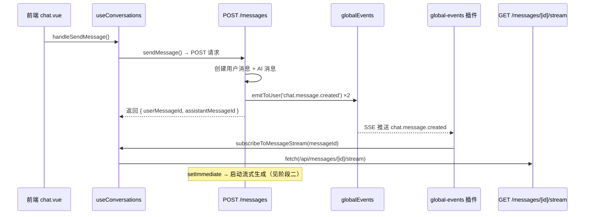

### 阶段二：流式生成与推送

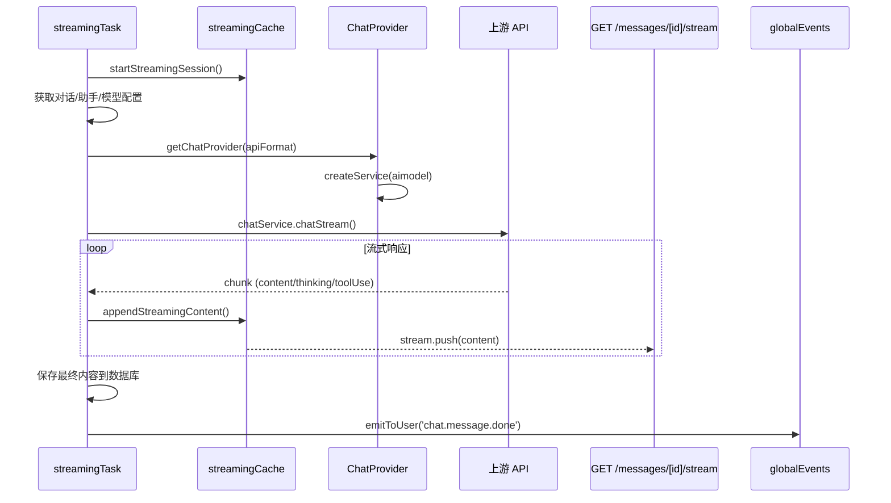

## 分层详解

### 1. 前端发送消息

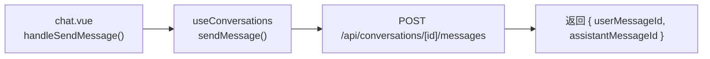

| 文件 | 函数 | 职责 |
|------|------|------|
| `app/pages/chat.vue` | `handleSendMessage()` | UI 入口，收集输入内容和附件 |
| `app/composables/useConversations.ts:516` | `sendMessage()` | 发起 POST 请求，不等待 AI 响应 |

### 2. API 路由处理

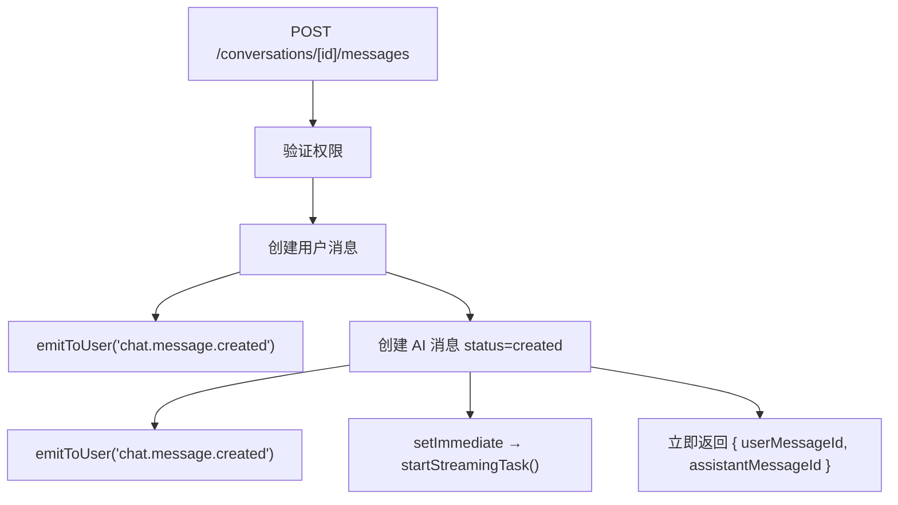

| 文件 | 关键逻辑 |
|------|---------|
| `server/api/conversations/[id]/messages.post.ts` | 创建两条消息后立即返回，通过 `setImmediate` 异步启动流式任务 |

> [!note] 异步解耦
> API 路由不等待 AI 生成完成，通过 `setImmediate` 将生成任务放入事件循环下一轮执行，前端通过 SSE 获取后续状态。

### 3. 流式生成核心

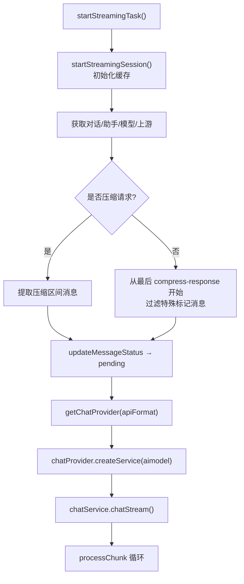

| 文件 | 函数 | 职责 |
|------|------|------|
| `server/services/streamingTask.ts:48` | `startStreamingTask()` | 流式生成主流程 |
| `server/services/streamingTask.ts:236` | `processChunk()` | 处理单个 chunk（content/thinking/toolUse/webSearch） |
| `server/services/streamingCache.ts:40` | `startStreamingSession()` | 初始化内存缓存 |
| `server/services/providerConnection.ts:6` | `resolveUpstreamConnection()` | 解析 apiKey + 代理 + baseUrl |

### 4. Provider 选择与服务创建

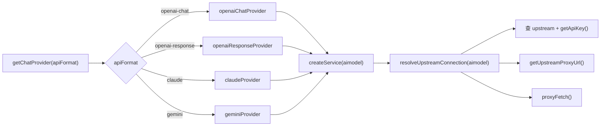

| 文件 | 职责 |
|------|------|
| `server/services/chatProviders/index.ts` | Provider 聚合入口，按 apiFormat 查找 |
| `server/services/upstream.ts:180` | `getApiKey()` — keyName → 'default' → 第一个 key 三层 fallback |
| `server/services/providerConnection.ts` | 统一解析连接参数（apiKey + fetchFn + baseUrl） |

### 5. 流式内容处理

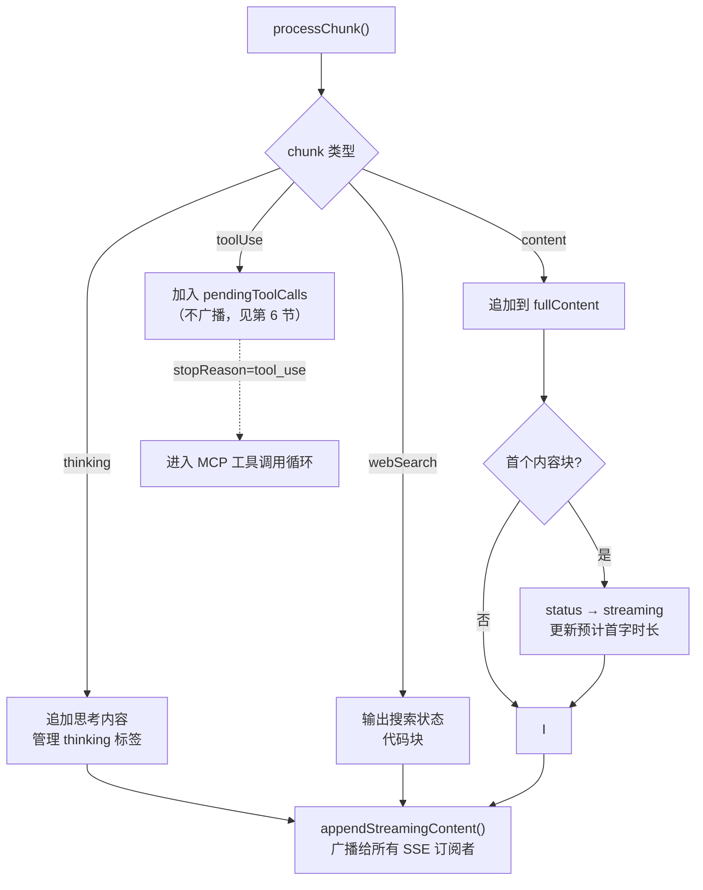

### 6. MCP 工具调用循环

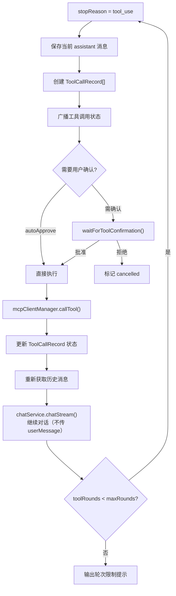

> [!warning] 最大轮次限制
> 工具调用有 `MCP_CLIENT_CONFIG.maxToolRounds` 轮次上限，超出后强制结束并输出提示。

### 7. 双通道同步机制

前端通过两个独立的 SSE 通道接收数据：

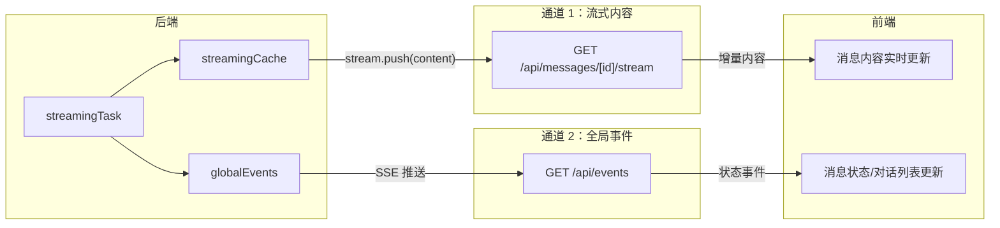

| 通道 | 端点 | 传输内容 | 前端处理 |
|------|------|---------|---------|
| 流式内容 | `GET /api/messages/[id]/stream` | 增量文本 chunk | `subscribeToMessageStream()` 逐块追加 |
| 全局事件 | `GET /api/events` | 结构化事件 | `global-events.client.ts` 插件分发 |

### 8. 前端事件处理

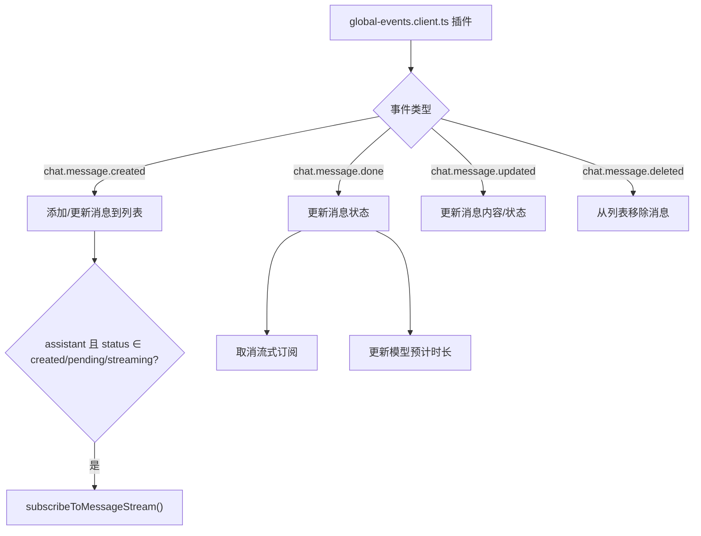

| 文件 | 职责 |
|------|------|
| `app/plugins/global-events.client.ts:73` | 监听 `chat.message.created`，触发流式订阅 |
| `app/plugins/global-events.client.ts:126` | 监听 `chat.message.done`，结束流式状态 |
| `app/composables/useConversations.ts:198` | `subscribeToMessageStream()` — 建立 SSE 连接读取增量内容 |

### 9. 停止生成

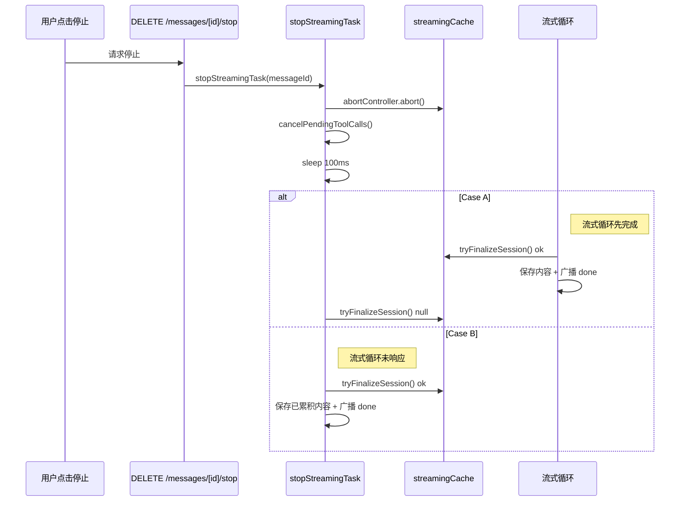

> [!note] 竞态条件处理
> `tryFinalizeSession()` 通过 `finalized` 标志实现原子操作，确保停止时只有一方（流式循环或 stopStreamingTask）负责保存内容。

## 关键文件索引

| 层级 | 文件 | 核心函数 |
|------|------|---------|
| 前端页面 | `app/pages/chat.vue` | `handleSendMessage()` |
| 前端状态 | `app/composables/useConversations.ts` | `sendMessage()`, `subscribeToMessageStream()` |
| 前端事件 | `app/plugins/global-events.client.ts` | `on('chat.message.created')`, `on('chat.message.done')` |
| API 路由 | `server/api/conversations/[id]/messages.post.ts` | 创建消息 + 异步启动任务 |
| 流式核心 | `server/services/streamingTask.ts` | `startStreamingTask()`, `stopStreamingTask()` |
| 流式缓存 | `server/services/streamingCache.ts` | `appendStreamingContent()`, `tryFinalizeSession()` |
| 全局事件 | `server/services/globalEvents.ts` | `emitToUser()` |
| Provider | `server/services/chatProviders/index.ts` | `getChatProvider()` |
| 连接解析 | `server/services/providerConnection.ts` | `resolveUpstreamConnection()` |
| Key 路由 | `server/services/upstream.ts:180` | `getApiKey(upstream, keyName)` |
