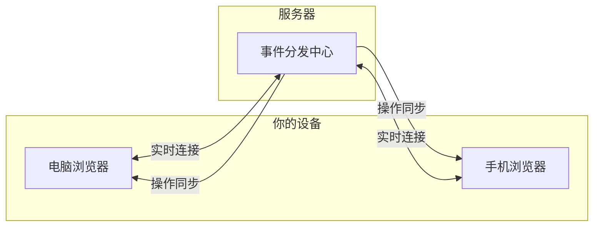

# 多端同步和流式输出

MJ Studio 支持多端实时同步，无论是 AI 对话还是绘图/视频任务，所有操作都会在你的设备间即时同步。

## 核心特性

### 多端实时同步

在多个浏览器标签页或设备上登录同一账号时，所有操作会实时同步：

- 在 A 标签页发送消息，B 标签页会立即看到新消息和 AI 回复
- 在手机上删除对话，电脑上的对话列表会同步更新
- 在 A 标签页创建绘图任务，B 标签页会看到任务出现并实时更新状态
- AI 生成的文字会在所有标签页同步显示（就像多人实时协作文档）

### AI 回复流式输出

AI 的回复会实时显示，让你看到生成过程：

- **即时反馈**：发送消息后几秒内就能看到 AI 开始回复
- **提前阅读**：AI 还在生成后半部分时，你就可以开始阅读前面的内容
- **随时中断**：点击停止按钮可随时打断，已生成的内容会保留

### 刷新不丢失

- 刷新页面或关闭标签页，后台仍在继续生成
- 重新打开时会自动显示已生成的内容，然后继续接收后续内容
- 发送消息后直接关闭浏览器，下次打开就能看到完整回复

### 任务状态实时更新

创建绘图或视频任务后，状态变化（提交中、处理中、成功、失败）会实时推送，无需手动刷新。

---

## 同步的操作

### 对话模块

| 操作 | 同步效果 |
|-----|---------|
| 发送消息 | 所有终端显示新消息 |
| AI 生成回复 | 所有终端同步显示流式输出 |
| 创建对话 | 所有终端的对话列表添加新对话 |
| 删除对话 | 所有终端的对话列表移除该对话 |
| 重命名对话 | 所有终端显示新标题 |
| 编辑消息 | 所有终端显示修改后的内容 |
| 删除消息 | 所有终端移除该消息 |

### 绘图/视频任务模块

| 操作 | 同步效果 |
|-----|---------|
| 创建任务 | 所有终端的任务列表添加新任务 |
| 任务状态变化 | 所有终端实时显示最新状态和进度 |
| 删除任务 | 所有终端的任务列表移除该任务 |
| 恢复任务 | 所有终端的任务列表重新显示该任务 |
| 切换模糊状态 | 所有终端同步显示模糊/清晰状态 |

---

## 工作原理



系统采用 Server-Sent Events (SSE) 技术建立长连接。登录后，浏览器会自动与服务器建立连接，任何操作发生时服务器会推送更新到你的所有终端。

---

## 消息状态说明

AI 消息有以下几种状态：

| 状态 | 说明 | UI 表现 |
|------|------|---------|
| 正在创建 | 消息已创建，正在准备发送给 AI | 加载动画 |
| 等待响应 | 请求已发送，等待 AI 首字 | 加载动画 |
| 流式输出中 | AI 正在生成，文字实时显示 | 停止按钮 |
| 已完成 | AI 生成完毕 | 正常显示 |
| 已停止 | 用户主动停止生成 | 显示"已中断"标记 |
| 生成失败 | 遇到错误（如 API 故障） | 错误样式 |

---

## 常见问题

**Q: 为什么有时候输出很快，有时候很慢？**

输出速度取决于 AI 模型的生成速度和服务器负载。

**Q: 点击停止后，为什么有时候还会多显示几个字？**

停止请求需要发送到服务器再中止 AI 生成，存在网络延迟。

**Q: 多端同步时，为什么有时候有几秒延迟？**

正常情况下延迟小于 1 秒。如果某端网络较慢或处于休眠状态，可能会有几秒延迟。

**Q: 关闭浏览器后，AI 还会继续生成吗？**

会的。服务器会独立完成生成过程，下次打开浏览器时就能看到完整回复。

---

## 部署注意事项

如果使用 Nginx 反向代理，需要为 SSE 端点禁用缓冲：

```nginx
location = /api/events {
    proxy_pass http://localhost:3000;
    proxy_http_version 1.1;
    proxy_set_header Host $host;
    proxy_set_header Connection '';
    proxy_buffering off;
    proxy_cache off;
    proxy_read_timeout 86400s;
}
```

## 当前限制

- **单实例部署**：目前仅支持单进程部署，多实例需要额外配置
- **断线不重放**：断线重连后不会补发错过的事件，页面刷新即可获取最新状态
