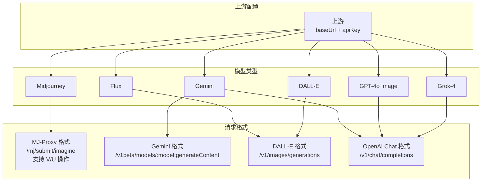

# 重构上游模型配置

## 需求内容

### 当前问题

当前架构中，上游配置仅包含：
- 上游名称、请求地址、API Key
- 支持的模型类型数组（如 `['midjourney', 'gemini']`）

系统根据模型类型**隐式推断**请求格式：
- midjourney → MJ-Proxy 格式
- gemini → Gemini API 格式

这种设计存在以下问题：
1. **扩展性差**：新增模型类型需要同时实现对应的请求格式
2. **灵活性不足**：同一模型可能支持多种请求格式（如 Gemini 支持 Gemini 格式和 OpenAI 兼容格式）
3. **无法复用**：不同模型使用相同请求格式时需要重复实现

### 目标架构

将"模型类型"与"请求格式"解耦，形成三层结构：



### 请求格式详解

| 请求格式 | 端点 | 特点 | 适用模型 |
|---------|------|------|---------|
| MJ-Proxy | `/mj/submit/imagine` 等 | 异步任务，支持 V/U 操作 | Midjourney |
| Gemini | `/v1beta/models/:model:generateContent` | 同步返回 base64 | Gemini |
| DALL-E | `/v1/images/generations` | 同步返回 URL 或 base64 | DALL-E 3, Flux |
| OpenAI Chat | `/v1/chat/completions` | 图片在 content 中返回 | GPT-4o, Grok-4 |

### 功能特性对比

| 特性 | MJ-Proxy | Gemini | DALL-E | OpenAI Chat |
|------|----------|--------|--------|-------------|
| 文生图 | ✅ | ✅ | ✅ | ✅ |
| 垫图 | ✅ base64Array | ✅ parts.inlineData | ⚠️ 需 /edits 端点 | ✅ messages 图片 |
| 混图 | ✅ /blend | ❌ | ❌ | ❌ |
| V/U 操作 | ✅ | ❌ | ❌ | ❌ |
| 异步轮询 | ✅ | ❌ | ❌ | ❌ |
| 进度显示 | ✅ | ❌ | ❌ | ❌ |

**垫图实现方式：**
- **MJ-Proxy**：`base64Array` 参数传递参考图
- **Gemini**：`contents[].parts[].inlineData` 传递 base64 图片
- **DALL-E**：标准 generations 不支持，需使用 `/v1/images/edits` 端点（需中转站支持）
- **OpenAI Chat**：messages 中使用 `image_url` 或 base64 格式传递图片（multimodal 输入）

---

## 实施方案

### 1. 数据库 Schema 修改

**model_configs 表：**
- 移除 `types: ModelType[]` 字段
- 新增 `modelTypeConfigs: ModelTypeConfig[]` 字段，每项包含：
  - `modelType`: 模型类型（midjourney/gemini/flux/dalle/gpt4o-image/grok-image）
  - `apiFormat`: 请求格式（mj-proxy/gemini/dalle/openai-chat）
  - `modelName`: 实际模型名称（如 "dall-e-3", "gpt-4o-image"）
  - `estimatedTime`: 预计生成时间（秒），用于前端倒计时进度显示

**tasks 表：**
- 新增 `apiFormat` 字段：记录使用的请求格式
- 新增 `modelName` 字段：记录实际使用的模型名称

### 2. 新增请求格式服务

- `server/services/dalle.ts`：DALL-E 格式服务
  - `generateImage()`: 文生图，POST `/v1/images/generations`
  - `editImage()`: 垫图，POST `/v1/images/edits`

- `server/services/openaiChat.ts`：OpenAI Chat 格式服务
  - `generateImage()`: 文生图，POST `/v1/chat/completions`
  - `generateImageWithRef()`: 垫图，messages 中包含图片

- `server/services/types.ts`：统一返回类型 `GenerateResult`

### 3. 修改现有服务

- `server/services/gemini.ts`：添加垫图支持（parts.inlineData）
- `server/services/task.ts`：根据 apiFormat 调度不同服务

### 4. 前端修改

- `app/pages/settings.vue`：模型配置表单改为配置 modelTypeConfigs
  - 每个模型类型可选择请求格式
  - 可填写模型名称
- `app/components/DrawingPanel.vue`：适配新的数据结构

**模型名称处理：**
- 添加模型类型时，根据类型**默认填充**模型名称（见下表）
- 用户可修改模型名称以适配不同中转站的命名差异
- 例如：同样是 DALL-E，不同中转站可能叫 `dall-e-3`、`dalle-3`、`dall-e-3-hd` 等

### 5. 数据库迁移

- 将现有 `types` 字段数据转换为 `modelTypeConfigs` 格式
- midjourney → `{ modelType: 'midjourney', apiFormat: 'mj-proxy' }`
- gemini → `{ modelType: 'gemini', apiFormat: 'gemini', modelName: 'gemini-2.5-flash-image' }`

### 6. 模型类型与请求格式对应关系

| 模型类型 | 可用请求格式 | 默认模型名称 | 默认预计时间 |
|---------|------------|-------------|-------------|
| midjourney | mj-proxy | - | 60s |
| gemini | gemini, openai-chat | gemini-2.5-flash-image | 15s |
| flux | dalle | flux-dev | 20s |
| dalle | dalle | dall-e-3 | 15s |
| gpt4o-image | openai-chat | gpt-4o-image | 30s |
| grok-image | openai-chat | grok-4 | 30s |

### 7. 预计生成时间机制

**初始值：** 添加模型类型时，根据类型填充默认预计时间（见上表）

**动态更新：** 任务成功完成时，用实际耗时更新对应模型的预计时间
- 更新策略：使用最近一次任务的实际耗时（或可选用移动平均）
- 更新位置：`server/services/task.ts` 任务完成回调中

**前端使用：**
- 任务开始时，读取对应模型的 `estimatedTime`
- 显示倒计时进度条：`进度 = 已用时间 / 预计时间 * 100%`
- 超过预计时间后，进度条保持 99% 或显示"即将完成"

---

## 实施结果

### 已完成功能

**数据库层：**
- ✅ `model_configs` 表：移除 `types` 字段，新增 `model_type_configs` JSON 字段
- ✅ `tasks` 表：新增 `api_format` 和 `model_name` 字段
- ✅ 数据迁移：历史数据已转换为新格式

**服务层：**
- ✅ `server/services/types.ts`：统一 `GenerateResult` 返回类型
- ✅ `server/services/dalle.ts`：DALL-E 格式服务
  - 文生图：`POST /v1/images/generations`
  - 垫图：`POST /v1/images/edits`（multipart/form-data 格式）
- ✅ `server/services/openaiChat.ts`：OpenAI Chat 格式服务
  - 支持文生图和垫图（messages 中包含图片）
- ✅ `server/services/task.ts`：根据 `apiFormat` 调度不同服务
- ✅ 预计生成时间动态更新机制

**前端：**
- ✅ `app/pages/settings.vue`：模型配置表单支持 `modelTypeConfigs`
  - 每个模型类型可选择请求格式和模型名称
  - 支持配置预计生成时间
- ✅ `app/components/DrawingPanel.vue`：适配新数据结构
- ✅ `app/components/TaskCard.vue`：
  - 支持显示所有模型类型（MJ/Gemini/Flux/DALL-E/GPT-4o/Grok）
  - 任务详情显示请求格式

### 支持的模型类型

| 模型类型 | 请求格式 | 默认模型名称 | 文生图 | 垫图 |
|---------|---------|-------------|-------|-----|
| Midjourney | MJ-Proxy | - | ✅ | ✅ |
| Gemini | Gemini API | gemini-2.5-flash-image | ✅ | ✅ |
| Flux | DALL-E API | flux-dev | ✅ | ✅ |
| DALL-E | DALL-E API | dall-e-3 | ✅ | ✅ |
| GPT-4o Image | OpenAI Chat | gpt-4o-image | ✅ | ✅ |
| Grok Image | OpenAI Chat | grok-4 | ✅ | ✅ |

### 新增文件

```
server/services/
├── types.ts        # 统一返回类型定义
├── dalle.ts        # DALL-E 格式服务
└── openaiChat.ts   # OpenAI Chat 格式服务
```

### 实施日期

2024-12-16
