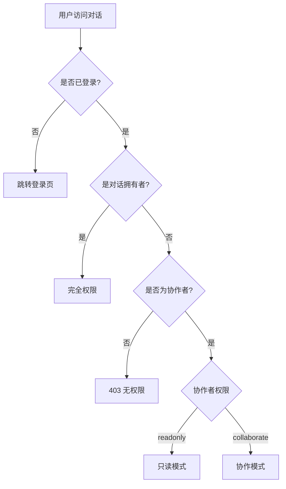
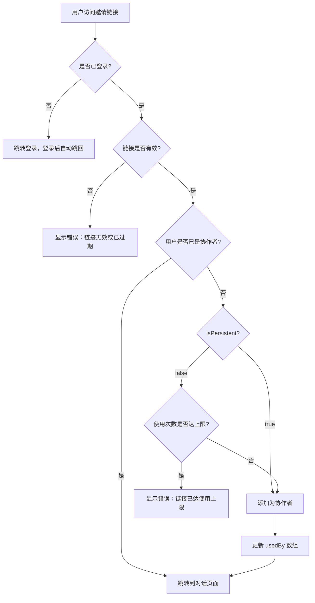

# 对话分享系统设计

本文档描述对话分享与协作功能的设计方案。

## 功能概述

允许对话拥有者将对话分享给其他用户，支持两种权限模式：
- **只读模式**：协作者可以查看对话内容，但不能进行任何修改
- **协作模式**：协作者可以参与对话，包括发送消息、编辑消息、删除消息等

## 核心概念

### 协作者（Collaborator）

协作者是被授权访问某个对话的用户。每个协作者有独立的权限级别：

| 权限 | 查看消息 | 发送消息 | 编辑消息 | 删除消息 | 触发 AI 回复 |
|-----|---------|---------|---------|---------|-------------|
| 只读 | ✓ | ✗ | ✗ | ✗ | ✗ |
| 协作 | ✓ | ✓ | ✓ | ✓ | ✓ |

> **说明**：协作者触发 AI 回复时，使用对话原有的助手配置和模型，消耗对话拥有者的额度。协作者页面不显示模型选择组件。

### 邀请方式

支持两种邀请方式：

1. **直接邀请**：通过用户名或邮箱搜索用户，直接添加为协作者
2. **链接邀请**：生成邀请链接，用户通过链接加入成为协作者

## 数据模型

### 对话协作者表（conversation_collaborators）

存储对话的协作者关系。

| 字段 | 类型 | 说明 |
|-----|------|-----|
| id | INTEGER | 主键 |
| conversationId | INTEGER | 关联对话 ID |
| userId | INTEGER | 协作者用户 ID |
| permission | TEXT | 权限：`readonly` / `collaborate` |
| invitedBy | INTEGER | 邀请人用户 ID（对话拥有者） |
| inviteLinkId | INTEGER | 通过哪个邀请链接加入（可选） |
| createdAt | TIMESTAMP | 加入时间 |

**唯一约束**：`(conversationId, userId)` —— 同一用户在同一对话中只能有一条记录。

### 对话邀请链接表（conversation_invite_links）

存储邀请链接信息。

| 字段 | 类型 | 说明 |
|-----|------|-----|
| id | INTEGER | 主键 |
| conversationId | INTEGER | 关联对话 ID |
| creatorId | INTEGER | 创建者用户 ID |
| token | TEXT | 链接 Token（UUID + 前缀） |
| permission | TEXT | 通过此链接加入后的权限：`readonly` / `collaborate` |
| isPersistent | BOOLEAN | 是否持续有效（true=不限次数，false=有使用上限） |
| maxUses | INTEGER | 最大使用次数（仅 isPersistent=false 时有效） |
| usedBy | JSON | 已使用此链接的用户 ID 数组 |
| expiresAt | TIMESTAMP | 过期时间（null=永不过期） |
| isRevoked | BOOLEAN | 是否已撤销 |
| createdAt | TIMESTAMP | 创建时间 |

## 链接格式设计

### Token 生成规则

为防止穷举攻击，Token 采用复合格式：

```
{prefix}-{uuid}
```

- **prefix**：6 位随机字母数字（如 `a3x9kp`），增加随机性
- **uuid**：标准 UUID v4（如 `550e8400-e29b-41d4-a716-446655440000`）

完整示例：`a3x9kp-550e8400-e29b-41d4-a716-446655440000`

### URL 格式

```
/shared/chat/{token}
```

示例：
```
https://mj.example.com/shared/chat/a3x9kp-550e8400-e29b-41d4-a716-446655440000
```

## 权限校验流程

### 访问对话



### 使用邀请链接



## API 设计

### 协作者管理

| 方法 | 端点 | 功能 |
|-----|------|-----|
| GET | `/api/conversations/[id]/collaborators` | 获取协作者列表 |
| POST | `/api/conversations/[id]/collaborators` | 直接添加协作者 |
| PATCH | `/api/conversations/[id]/collaborators/[userId]` | 修改协作者权限 |
| DELETE | `/api/conversations/[id]/collaborators/[userId]` | 移除协作者 |

### 邀请链接管理

| 方法 | 端点 | 功能 |
|-----|------|-----|
| GET | `/api/conversations/[id]/invite-links` | 获取邀请链接列表 |
| POST | `/api/conversations/[id]/invite-links` | 创建邀请链接 |
| DELETE | `/api/conversations/[id]/invite-links/[linkId]` | 撤销邀请链接 |

### 加入对话

| 方法 | 端点 | 功能 |
|-----|------|-----|
| GET | `/api/shared/chat/[token]` | 验证链接并获取对话信息 |
| POST | `/api/shared/chat/[token]/join` | 通过链接加入成为协作者 |

### 搜索用户

| 方法 | 端点 | 功能 |
|-----|------|-----|
| GET | `/api/users/search?q={keyword}` | 搜索用户（用于直接邀请） |

## 实时同步

基于现有的全局事件订阅系统（SSE），扩展支持协作者场景：

### 事件分发规则

当对话发生变更时，需要通知：
1. 对话拥有者
2. 所有该对话的协作者

### 新增事件类型

| 事件 | 触发场景 | 接收者 |
|-----|---------|--------|
| `collaborator:added` | 新协作者加入 | 对话拥有者 |
| `collaborator:removed` | 协作者被移除 | 对话拥有者、被移除者 |
| `collaborator:permission-changed` | 权限变更 | 被变更者 |

### 消息同步

现有的消息事件已支持多用户同步：
- `message:created` - 新消息
- `message:updated` - 消息编辑
- `message:deleted` - 消息删除
- `message:streaming` - AI 流式输出

需要修改事件分发逻辑，从"按用户 ID 分发"改为"按对话权限分发"。

## 日志增强

在现有服务端日志基础上，添加操作人信息：

```typescript
// 日志格式示例
console.log(`[Conversation ${conversationId}] 用户 ${userId}(${userName}) 发送消息`)
console.log(`[Conversation ${conversationId}] 用户 ${userId}(${userName}) 删除消息 ${messageId}`)
```

## 前端界面

### 对话详情页 - 协作者管理

在对话设置中添加"协作者管理"入口：

```
┌─────────────────────────────────────────────┐
│ 协作者管理                              [+] │
├─────────────────────────────────────────────┤
│ 👤 张三  readonly   [编辑] [移除]           │
│ 👤 李四  collaborate [编辑] [移除]          │
├─────────────────────────────────────────────┤
│ 邀请链接                               [+]  │
├─────────────────────────────────────────────┤
│ 🔗 只读链接  永久有效  3人已使用  [复制][撤销]│
│ 🔗 协作链接  7天后过期 0人已使用  [复制][撤销]│
└─────────────────────────────────────────────┘
```

### 创建邀请链接弹窗

```
┌─────────────────────────────────────────────┐
│ 创建邀请链接                                │
├─────────────────────────────────────────────┤
│ 权限：  ○ 只读   ● 协作                     │
├─────────────────────────────────────────────┤
│ 有效期：                                    │
│   ○ 永不过期                                │
│   ● 7 天后过期                              │
│   ○ 自定义 [____] 天                        │
├─────────────────────────────────────────────┤
│ 使用次数：                                  │
│   ○ 不限次数                                │
│   ● 限制 [10] 人                            │
├─────────────────────────────────────────────┤
│               [取消]  [创建]                │
└─────────────────────────────────────────────┘
```

### 直接邀请弹窗

```
┌─────────────────────────────────────────────┐
│ 邀请用户                                    │
├─────────────────────────────────────────────┤
│ 搜索用户：[____________] 🔍                 │
│                                             │
│ 搜索结果：                                  │
│   👤 zhangsan (zhang@example.com)  [邀请]   │
│   👤 zhangwei (wei@example.com)    [邀请]   │
├─────────────────────────────────────────────┤
│ 权限：  ○ 只读   ● 协作                     │
└─────────────────────────────────────────────┘
```

### 协作者视角

协作者打开对话时，界面与拥有者略有不同：

1. **标题区域**：显示"协作中"标识和权限级别
2. **只读模式**：隐藏输入框，显示"只读模式"提示
3. **协作模式**：显示输入框，但隐藏模型选择器
4. **设置限制**：协作者不能修改助手配置、删除对话等

```
┌─────────────────────────────────────────────┐
│ 📝 技术讨论  [协作中·可编辑]                 │
├─────────────────────────────────────────────┤
│ ... 消息列表 ...                            │
├─────────────────────────────────────────────┤
│ [输入消息...]                         [发送] │
└─────────────────────────────────────────────┘
```

## 安全考虑

### Token 安全

1. **长度**：Token 总长度约 43 字符（6 + 1 + 36），熵值足够高
2. **不可预测**：使用 crypto.randomUUID() 生成，无法猜测
3. **一次性验证**：API 验证时检查数据库记录，不依赖 Token 本身携带信息

### 权限隔离

1. 协作者无法访问对话拥有者的其他数据（上游配置、助手配置等）
2. 协作者发送消息时，后端强制使用对话绑定的助手配置
3. 协作者无法修改对话的分享设置

### 防滥用

1. 邀请链接可设置使用上限，防止被大规模传播
2. 拥有者可随时撤销链接或移除协作者
3. 考虑添加每个对话最大协作者数量限制（如 50 人）

## 数据库迁移

```sql
-- 创建对话协作者表
CREATE TABLE conversation_collaborators (
  id INTEGER PRIMARY KEY AUTOINCREMENT,
  conversation_id INTEGER NOT NULL,
  user_id INTEGER NOT NULL,
  permission TEXT NOT NULL DEFAULT 'readonly',
  invited_by INTEGER NOT NULL,
  invite_link_id INTEGER,
  created_at INTEGER NOT NULL,
  UNIQUE(conversation_id, user_id)
);

-- 创建对话邀请链接表
CREATE TABLE conversation_invite_links (
  id INTEGER PRIMARY KEY AUTOINCREMENT,
  conversation_id INTEGER NOT NULL,
  creator_id INTEGER NOT NULL,
  token TEXT NOT NULL UNIQUE,
  permission TEXT NOT NULL DEFAULT 'readonly',
  is_persistent INTEGER NOT NULL DEFAULT 0,
  max_uses INTEGER,
  used_by TEXT DEFAULT '[]',
  expires_at INTEGER,
  is_revoked INTEGER NOT NULL DEFAULT 0,
  created_at INTEGER NOT NULL
);

-- 为 token 创建索引，加速链接验证
CREATE INDEX idx_invite_links_token ON conversation_invite_links(token);
```

## 实现计划

1. **Phase 1：数据模型**
   - 创建数据库迁移
   - 实现 Schema 定义
   - 创建 Service 层

2. **Phase 2：API 实现**
   - 协作者 CRUD API
   - 邀请链接 CRUD API
   - 加入对话 API
   - 用户搜索 API

3. **Phase 3：权限集成**
   - 修改现有对话 API 的权限校验
   - 扩展事件分发逻辑
   - 添加日志增强

4. **Phase 4：前端界面**
   - 协作者管理组件
   - 邀请链接管理组件
   - 协作者视角适配

## 后续扩展

- [ ] 协作者在线状态显示
- [ ] 正在输入提示
- [ ] 协作者头像列表展示
- [ ] 对话活动历史（谁在什么时候做了什么）
