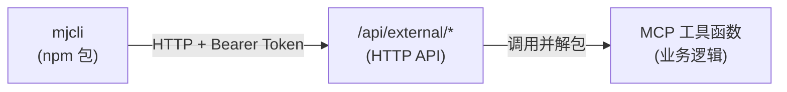
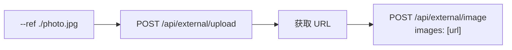

# mjcli 设计文档

## 定位

命令行客户端，主要面向 AI Agent（Claude Code、Cursor 等），兼顾人类终端使用。通过 HTTP API 调用 MJ-Studio 的全部能力。

## 架构



### 两部分工作

1. **服务端**：扩展 `/api/external/` 接口，复用已有 MCP 工具函数
2. **CLI 包**：独立 npm 包 `@shellus/mjcli`，纯 HTTP 客户端

## 服务端设计

### 新增接口

| 接口 | 方法 | 说明 | 复用 MCP 工具 |
|------|------|------|--------------|
| `/api/external/models` | GET | 列出模型 | `listModels()` |
| `/api/external/assistants` | GET | 列出助手 | `listAssistants()` |
| `/api/external/image` | POST | 生成图片 | `generateImage()` |
| `/api/external/video` | POST | 生成视频 | `generateVideo()` |
| `/api/external/tasks` | GET | 列出任务 | `listTasks()` |
| `/api/external/tasks/[id]` | GET | 查看任务 | `getTask()` |
| `/api/external/upload` | POST | 上传文件 | 复用 `/api/mcp/upload` 逻辑 |

已有接口（无需改动）：
- `POST /api/external/chat` — 对话

### 复用方式

MCP 工具函数返回 MCP Tool Result 格式：

```typescript
{ content: [{ type: 'text', text: JSON.stringify(data) }], isError?: boolean }
```

HTTP API 层调用后解包：

```typescript
// server/utils/external-api.ts
export function unwrapMcpResult(mcpResult: McpToolResult): { data: any; isError: boolean } {
  const text = mcpResult.content[0].text
  const data = JSON.parse(text)
  const isError = mcpResult.isError || false
  return { data, isError }
}
```

接口实现模式统一：

```typescript
// 示例：GET /api/external/models
export default defineEventHandler(async (event) => {
  const { user } = await requireApiKeyAuth(event)
  const category = getQuery(event).category as string | undefined

  const mcpResult = await listModels(user, category as ModelCategory)
  const { data, isError } = unwrapMcpResult(mcpResult)

  if (isError) {
    setResponseStatus(event, 400)
    return { status: 'error', error: data.error }
  }

  return { status: 'ok', data }
})
```

### 响应格式

与已有 `chat.post.ts` 一致：

```json
// 成功
{ "status": "ok", "data": { ... } }

// 错误
{ "status": "error", "error": "错误描述" }
```

### 上传接口

`POST /api/external/upload` 直接接受 `multipart/form-data`，认证方式与其他接口一致（Bearer API Key），无需两步获取临时 token：

```
POST /api/external/upload
Authorization: Bearer mjs_xxx
Content-Type: multipart/form-data

file=@/path/to/image.jpg
```

返回：
```json
{ "status": "ok", "data": { "url": "https://domain.com/api/images/xxx.jpg" } }
```

> [!note] 与 MCP upload 的区别
> MCP 的 `get_upload_url` 需要两步（获取临时 token → 上传），因为 MCP 协议不支持直接传文件。HTTP API 直接一步上传，更简单。

---

## CLI 设计

### 包信息

- **npm 包名**：`@shellus/mjcli`
- **命令名**：`mjcli`
- **运行环境**：Node.js 18+

### 目录结构

```
mjcli/
├── src/
│   ├── index.ts           # 入口，commander 命令定义
│   ├── api.ts             # HTTP 请求封装（fetch + 认证 + 错误处理）
│   ├── config.ts          # 环境变量读取（MJCLI_URL, MJCLI_KEY）
│   ├── output.ts          # TTY 检测 + JSON/文本输出
│   ├── upload.ts          # 文件上传（multipart/form-data）
│   └── commands/
│       ├── model.ts       # mjcli model ls
│       ├── assistant.ts   # mjcli assistant ls
│       ├── chat.ts        # mjcli chat
│       ├── image.ts       # mjcli image
│       ├── video.ts       # mjcli video
│       └── task.ts        # mjcli task ls / task get
├── package.json
├── tsconfig.json
└── README.md
```

### 依赖

```json
{
  "dependencies": {
    "commander": "^12.0.0"
  }
}
```

> [!info] 极简依赖
> - HTTP 请求：Node 18+ 内置 `fetch`
> - 文件上传：Node 内置 `FormData`
> - 彩色输出：ANSI 转义码手写，不依赖 chalk
> - 尽量 zero-dependency，commander 是唯一运行时依赖

### 配置

纯环境变量：

| 变量 | 必填 | 说明 |
|------|------|------|
| `MJCLI_URL` | 是 | 服务端地址（不含尾部 `/`） |
| `MJCLI_KEY` | 是 | API Key（`mjs_` 前缀） |

### 输出格式

- TTY：人类可读（表格/列表，带 ANSI 颜色）
- 非 TTY：JSON（一行 `JSON.stringify`）
- `--json`：强制 JSON
- `--pretty`：强制人类可读

### 命令映射

| 命令 | HTTP 请求 | 说明 |
|------|----------|------|
| `mjcli model ls [-t type]` | `GET /api/external/models?category=type` | 列出模型 |
| `mjcli assistant ls` | `GET /api/external/assistants` | 列出助手 |
| `mjcli chat -a ID "msg"` | `POST /api/external/chat` | 对话 |
| `mjcli image -m ID "prompt"` | `POST /api/external/image` | 生成图片 |
| `mjcli video -m ID "prompt"` | `POST /api/external/video` | 生成视频 |
| `mjcli task ls` | `GET /api/external/tasks` | 列出任务 |
| `mjcli task get ID` | `GET /api/external/tasks/ID` | 查看任务 |
| `mjcli upload FILE` | `POST /api/external/upload` | 上传文件 |

### 文件上传流程（`--ref` 参数）



`image` 和 `video` 命令检测到 `--ref` 为本地路径时，自动先上传再提交。

### 退出码

| 退出码 | 说明 |
|-------|------|
| `0` | 成功 |
| `1` | 一般错误（参数错误、网络错误） |
| `2` | 认证失败（401） |
| `3` | 任务失败（上游拒绝） |
| `4` | 任务超时 |

### 错误处理

```typescript
// api.ts 统一处理
async function request(method, path, body?) {
  const res = await fetch(url + path, { method, headers, body })

  if (res.status === 401) process.exit(2)

  const json = await res.json()
  if (json.status === 'error') {
    // 输出错误信息到 stderr
    console.error(json.error)
    process.exit(1)
  }

  return json.data
}
```

---

## 文档更新

完成后需更新：

1. `docs/features/CLI工具介绍.md` — 已写好
2. `docs/features/HTTP API接口介绍.md` — 补充新增的接口
3. `README.md` — 在文档索引中添加 CLI 工具链接
