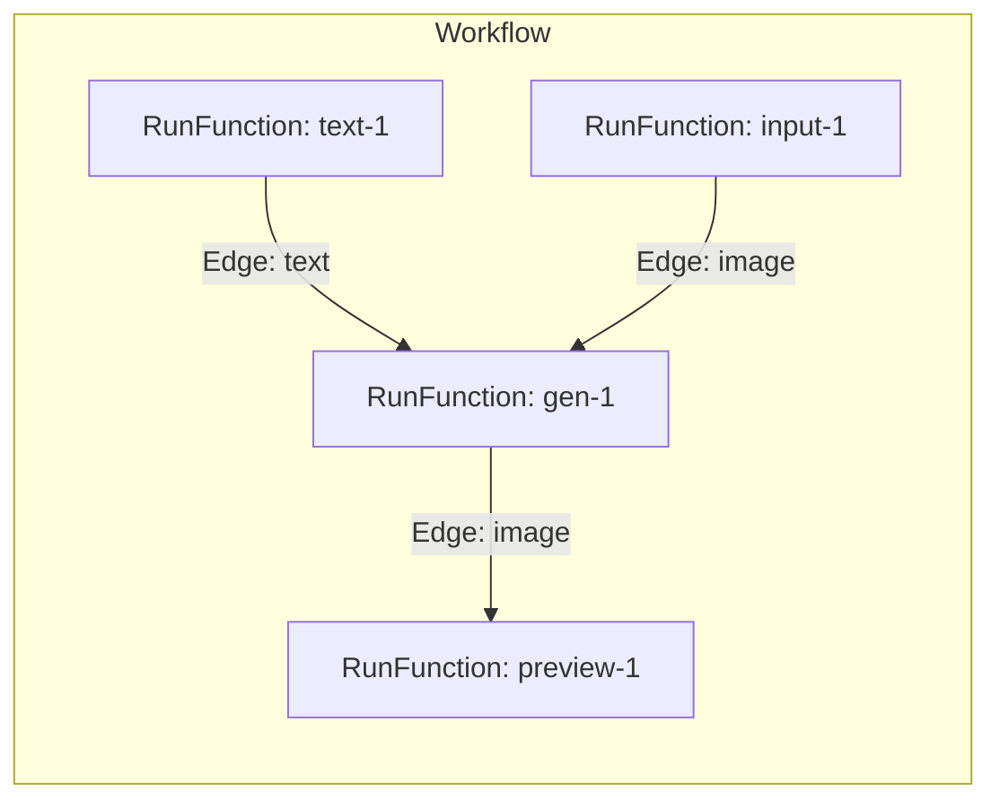
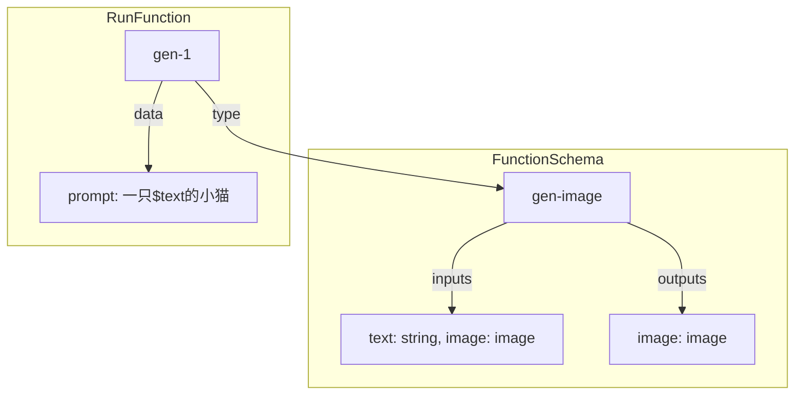
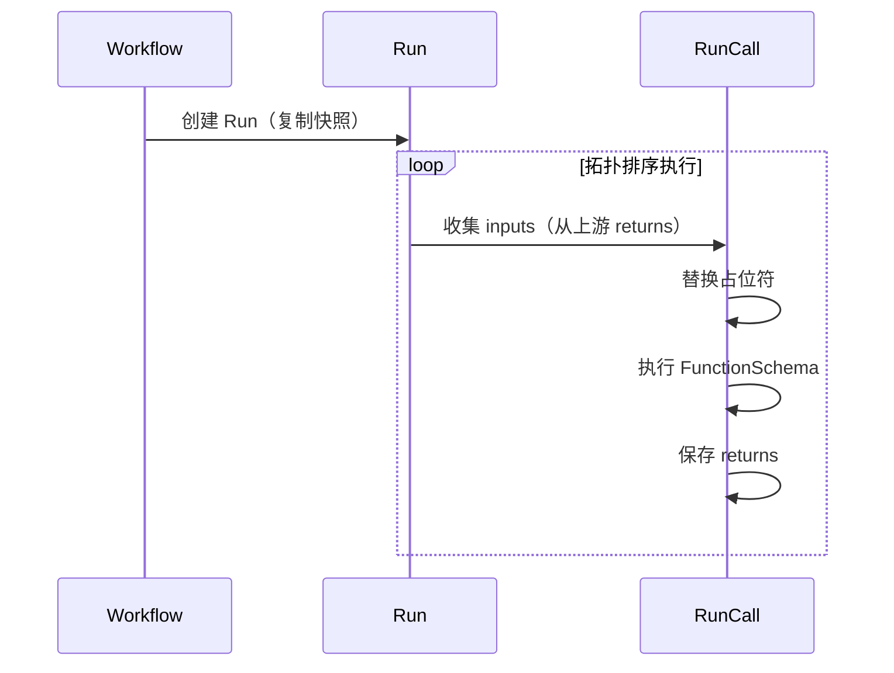
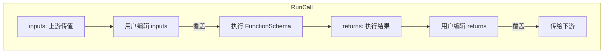

# 工作流节点类型系统设计

## 名词表

| 名称 | 简述 | 存储位置 | 用户界面术语 |
|-----|------|---------|-------------|
| **FunctionSchema** | 函数定义，声明参数和返回值类型 | `data/node-types/*.json` | 节点类型 |
| **RunFunction** | 函数调用实例 | `workflow.calls[]` | 节点 |
| **Argument** | 调用参数，字面量或引用 | `runFunction.data` | 节点配置 |
| **Return** | 函数返回值 | `runCall.returns` | 节点结果 |
| **Edge** | 参数绑定，连接两个 RunFunction | `workflow.edges[]` | 连线 |
| **Workflow** | RunFunction 和 Edge 的集合 | `data/workflows/*.json` | 工作流 |
| **Run** | 一次工作流执行 | `workflow_runs` 表 | 运行记录 |
| **RunCall** | Run 中某个 RunFunction 的执行状态 | `workflow_run_calls` 表 | 节点运行状态 |

---

## 概念说明

### FunctionSchema

**语义**：FunctionSchema 是函数的类型定义，声明了输入参数（inputs）、返回值（outputs）和配置项（arguments）。

**类比**：编程语言中的函数签名 / JSON Schema。

```typescript
// TypeScript 函数声明
function genImage(text: string, image?: string[]): string

// 对应的 FunctionSchema
{
  type: "gen-image",
  inputs: { text: { type: "string" }, image: { type: "image" } },
  outputs: { image: { type: "image" } }
}
```

**约束**：
- 每个 FunctionSchema 有唯一的 `type` 标识
- inputs 和 outputs 的字段名不能重复

---

### RunFunction

**语义**：RunFunction 是对 FunctionSchema 的一次调用实例，指定了具体的参数值。

**类比**：编程语言中的函数调用表达式。

```typescript
// TypeScript 函数调用
const result = genImage({ text: "小猫", prompt: "一只${text}" })

// 对应的 RunFunction
{
  id: "gen-1",
  type: "gen-image",
  data: { text: "小猫", prompt: "一只${text}" }
}
```

**约束**：
- 每个 RunFunction 有唯一的 `id`
- `type` 必须是已注册的 FunctionSchema

---

### Argument

**语义**：Argument 是 RunFunction 的参数值，可以是字面量或引用其他 RunFunction 的返回值。

**类比**：函数调用时传入的实参。

```typescript
// 字面量参数
{ prompt: "一只小猫", upstreamId: 1 }

// 引用参数（通过占位符）
{ prompt: "一只${text}的小猫" }  // ${text} 引用 inputs.text
```

**约束**：
- 占位符语法：`${inputName}` 或 `${inputName[index]}`
- 只有 `text` 类型的参数支持占位符

---

### Return

**语义**：Return 是 RunFunction 执行后的返回值，可传递给下游 RunFunction。

**类比**：函数的返回值。

```typescript
// genImage 执行后返回
{ image: "/api/images/result.jpg" }
```

**约束**：
- Return 的字段必须符合 FunctionSchema 的 outputs 定义

---

### Edge

**语义**：Edge 将一个 RunFunction 的 Return 绑定到另一个 RunFunction 的输入端口，执行时自动传值。

**类比**：将一个函数的返回值作为另一个函数的参数。

```typescript
// TypeScript 中的参数传递
const text = textNode()
const image = genImage({ text: text })  // text 绑定

// 对应的 Edge
{
  source: "text-1",        // 源 RunFunction
  sourceHandle: "text",    // 源 Return 字段
  target: "gen-1",         // 目标 RunFunction
  targetHandle: "text"     // 目标输入端口
}
```

**约束**：
- source 的输出类型必须与 target 的输入类型匹配
- 同一个输入端口可以接收多个 Edge（收集为数组）

---

### Workflow

**语义**：Workflow 是一组 RunFunction 和 Edge 的集合，描述了完整的执行流程。

**类比**：一个程序或脚本。

**约束**：
- 必须是有向无环图（DAG）
- 保存时校验必填参数和必填输入端口

---

### Run

**语义**：Run 是 Workflow 的一次执行实例，包含执行时的快照和所有 RunFunction 的执行状态。

**类比**：程序的一次运行 / 调试会话。

**约束**：
- 创建时复制 Workflow 为快照，后续执行基于快照
- 快照不可修改

---

### RunCall

**语义**：RunCall 是 Run 中某个 RunFunction 的执行状态，记录输入值、返回值和状态。

**类比**：调试时的栈帧 / 断点状态。

```typescript
{
  runFunctionId: "gen-1",
  status: "success",
  inputs: { text: ["活泼"], image: [] },  // 实际输入（可编辑覆盖）
  returns: { image: "/api/images/result.jpg" }  // 实际返回（可编辑覆盖）
}
```

**约束**：
- inputs/returns 可在 Run 页面编辑，覆盖上游传值或执行结果
- 编辑后需手动触发重新执行

---

## 关系图

### Workflow 结构



### FunctionSchema 与 RunFunction 的关系



### Run 执行流程



### Run 时编辑



---

## 详细设计

### 数据类型

| 类型 | 说明 | 示例 |
|-----|------|-----|
| `image` | 图片 URL | `/api/images/xxx.jpg` |
| `video` | 视频 URL | `/api/images/xxx.mp4` |
| `string` | 文本 | `"一只可爱的小猫"` |

---

### FunctionSchema 定义结构

```typescript
interface FunctionSchema {
  type: string                              // 唯一标识
  label: string                             // 显示名称
  category: 'input' | 'output' | 'generate' // 分类
  icon: string                              // 图标

  inputs: Record<string, {
    type: 'image' | 'video' | 'string'
    label: string
    required?: boolean
  }>

  outputs: Record<string, {
    type: 'image' | 'video' | 'string'
    label: string
  }>

  arguments: Record<string, {
    type: 'string' | 'text' | 'number' | 'boolean' | 'select' | 'image' | 'upstream' | 'aimodel'
    label: string
    required?: boolean
    default?: any
  }>
}
```

---

### 内置 FunctionSchema

#### input-image

```json
{
  "type": "input-image",
  "label": "图片输入",
  "category": "input",
  "icon": "i-heroicons-photo",
  "inputs": {},
  "outputs": {
    "image": { "type": "image", "label": "图片" }
  },
  "arguments": {
    "label": { "type": "string", "label": "名称", "default": "图片输入" },
    "imageUrl": { "type": "image", "label": "图片", "required": true }
  }
}
```

执行：`return { image: args.imageUrl }`

#### text-node

```json
{
  "type": "text-node",
  "label": "文本",
  "category": "input",
  "icon": "i-heroicons-document-text",
  "inputs": {},
  "outputs": {
    "text": { "type": "string", "label": "文本" }
  },
  "arguments": {
    "label": { "type": "string", "label": "名称", "default": "文本" },
    "text": { "type": "text", "label": "内容", "required": true }
  }
}
```

执行：`return { text: args.text }`

#### gen-image

```json
{
  "type": "gen-image",
  "label": "AI 图像生成",
  "category": "generate",
  "icon": "i-heroicons-sparkles",
  "inputs": {
    "image": { "type": "image", "label": "参考图", "required": false },
    "text": { "type": "string", "label": "提示词输入", "required": false }
  },
  "outputs": {
    "image": { "type": "image", "label": "生成图片" }
  },
  "arguments": {
    "label": { "type": "string", "label": "名称", "default": "AI 图像生成" },
    "upstreamId": { "type": "upstream", "label": "上游配置", "required": true },
    "aimodelId": { "type": "aimodel", "label": "模型", "required": true },
    "prompt": { "type": "text", "label": "提示词" },
    "negativePrompt": { "type": "text", "label": "负面提示词" }
  }
}
```

执行逻辑：
1. 替换 `args.prompt` 中的 `${text}`
2. 调用 AI 接口
3. `return { image: 生成的图片URL }`

#### gen-video

```json
{
  "type": "gen-video",
  "label": "AI 视频生成",
  "category": "generate",
  "icon": "i-heroicons-film",
  "inputs": {
    "image": { "type": "image", "label": "参考图", "required": false },
    "text": { "type": "string", "label": "提示词输入", "required": false }
  },
  "outputs": {
    "video": { "type": "video", "label": "生成视频" }
  },
  "arguments": {
    "label": { "type": "string", "label": "名称", "default": "AI 视频生成" },
    "upstreamId": { "type": "upstream", "label": "上游配置", "required": true },
    "aimodelId": { "type": "aimodel", "label": "模型", "required": true },
    "prompt": { "type": "text", "label": "提示词" }
  }
}
```

#### preview-image

```json
{
  "type": "preview-image",
  "label": "图片预览",
  "category": "output",
  "icon": "i-heroicons-eye",
  "inputs": {
    "image": { "type": "image", "label": "图片", "required": true }
  },
  "outputs": {},
  "arguments": {
    "label": { "type": "string", "label": "名称", "default": "图片预览" }
  }
}
```

#### preview-video

```json
{
  "type": "preview-video",
  "label": "视频预览",
  "category": "output",
  "icon": "i-heroicons-play",
  "inputs": {
    "video": { "type": "video", "label": "视频", "required": true }
  },
  "outputs": {},
  "arguments": {
    "label": { "type": "string", "label": "名称", "default": "视频预览" }
  }
}
```

---

### 占位符

`text` 类型的 argument 支持占位符：

```
${inputName}      - 引用输入值，多个值用逗号连接
${inputName[0]}   - 引用第一个值
${inputName[1]}   - 引用第二个值
```

替换逻辑：

```typescript
function replacePlaceholders(args, inputs) {
  const result = { ...args }

  for (const [key, value] of Object.entries(result)) {
    if (typeof value !== 'string') continue

    result[key] = value.replace(/\$\{(\w+)(?:\[(\d+)\])?\}/g, (match, port, idx) => {
      const values = inputs[port]
      if (!values?.length) return match

      if (idx !== undefined) {
        return values[parseInt(idx)] ?? match
      }
      return values.join(', ')
    })
  }

  return result
}
```

---

### Edge 校验

类型必须匹配：

| 连接 | 允许 |
|-----|-----|
| image → image | ✅ |
| video → video | ✅ |
| string → string | ✅ |
| 其他 | ❌ |

同一输入端口可接收多个 Edge，收集为数组。

---

### 存储

#### FunctionSchema 存储

```
data/node-types/
├── builtin/
│   ├── input-image.json
│   ├── text-node.json
│   ├── gen-image.json
│   ├── gen-video.json
│   ├── preview-image.json
│   └── preview-video.json
└── custom/                    # 预留
```

#### Workflow JSON

```json
{
  "version": 2,
  "calls": [
    {
      "id": "text-1",
      "type": "text-node",
      "position": { "x": 50, "y": 100 },
      "data": { "label": "提示词", "text": "活泼可爱" }
    },
    {
      "id": "gen-1",
      "type": "gen-image",
      "position": { "x": 300, "y": 100 },
      "data": {
        "label": "生成图片",
        "upstreamId": 1,
        "aimodelId": 3,
        "prompt": "一只${text}的小猫"
      }
    }
  ],
  "edges": [
    {
      "id": "e1",
      "source": "text-1",
      "sourceHandle": "text",
      "target": "gen-1",
      "targetHandle": "text"
    }
  ],
  "viewport": { "x": 0, "y": 0, "zoom": 1 }
}
```

#### 数据库

`workflow_run_calls` 表（原 `workflow_run_nodes`）：

| 字段 | 类型 | 说明 |
|-----|------|-----|
| id | int | 主键 |
| runId | int | 关联 Run |
| runFunctionId | string | RunFunction ID |
| status | string | idle/pending/processing/success/failed |
| inputs | json | 实际输入（可编辑覆盖上游值） |
| returns | json | 实际返回（可编辑覆盖执行结果） |
| error | string | 错误信息 |

---

### 执行流程

```typescript
async function executeWorkflow(run) {
  const snapshot = loadSnapshot(run.snapshotFilename)
  const functionReturns = new Map()  // runFunctionId -> returns

  // 拓扑排序
  const sortedFunctions = topologicalSort(snapshot.calls, snapshot.edges)

  for (const runFunction of sortedFunctions) {
    const runCall = getRunCall(run.id, runFunction.id)

    // 1. 收集 inputs
    let inputs = collectInputs(runFunction.id, snapshot.edges, functionReturns)

    // 2. 用户编辑的 inputs 覆盖
    if (runCall.inputs) {
      inputs = { ...inputs, ...runCall.inputs }
    }

    // 3. 替换占位符
    const args = replacePlaceholders(runFunction.data, inputs)

    // 4. 执行
    let returns = await executors[runFunction.type](inputs, args)

    // 5. 用户编辑的 returns 覆盖
    if (runCall.returns) {
      returns = { ...returns, ...runCall.returns }
    }

    // 6. 保存
    await updateRunCall(runCall.id, { inputs, returns, status: 'success' })
    functionReturns.set(runFunction.id, returns)
  }
}

function collectInputs(runFunctionId, edges, functionReturns) {
  const inputs = {}

  for (const edge of edges.filter(e => e.target === runFunctionId)) {
    const value = functionReturns.get(edge.source)?.[edge.sourceHandle]
    if (value === undefined) continue

    if (!inputs[edge.targetHandle]) inputs[edge.targetHandle] = []
    inputs[edge.targetHandle].push(value)
  }

  return inputs
}
```

---

### Run 页面编辑

| 可编辑 | 存储位置 | 效果 |
|-------|---------|-----|
| inputs | `run_call.inputs` | 覆盖上游传值 |
| returns | `run_call.returns` | 覆盖执行结果 |

编辑后需手动点击"执行"按钮。

页面顶部提示："运行模式：修改仅对本次运行有效"

---

## 实施计划

### 第一阶段：FunctionSchema 系统

1. 创建 `data/node-types/builtin/*.json`
2. 定义 TypeScript 类型
3. 实现加载 API `/api/function-schemas`
4. 删除旧数据

### 第二阶段：Workflow 编辑器

1. 根据 FunctionSchema 渲染端口
2. Edge 类型校验
3. 保存校验

### 第三阶段：执行逻辑

1. 拓扑排序
2. inputs 收集
3. 占位符替换
4. FunctionSchema 执行器

### 第四阶段：Run 页面

1. 显示 inputs/returns
2. 编辑功能
3. 重新执行
